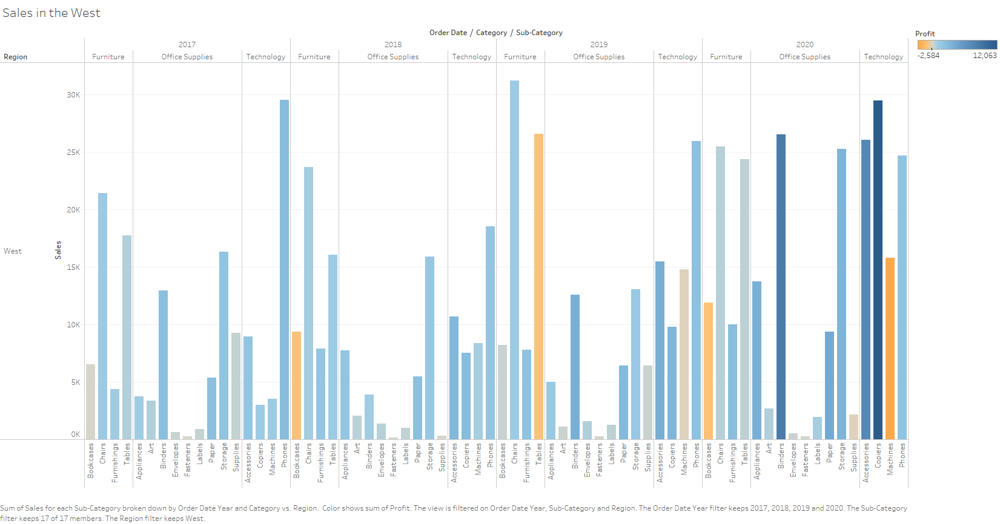
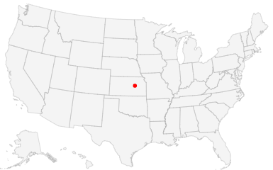
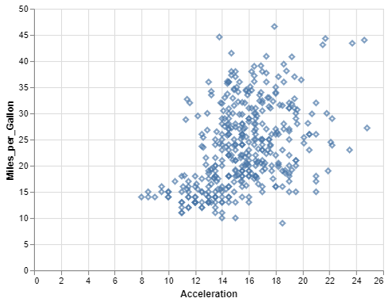
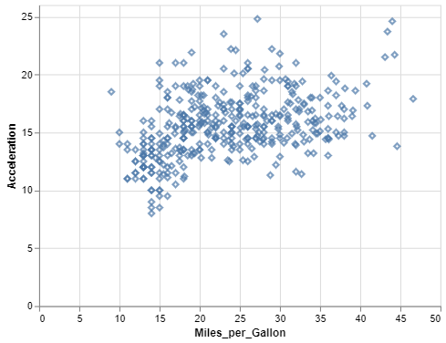
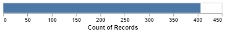
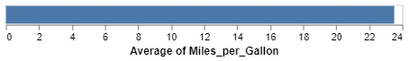

Homework 1
================
Triveni Sangama Saraswathi

CS 625, Fall 2020

## Git, GitHub

1.  *What is your GitHub username?*
    
    Triveniedla

2.  *What is the URL of your remote GitHub repo (created through
    Mr. Kennedy’s exercises)?*
    
    <git@github.com>:Triveniedla/cs625-fall-2020.git

## R

The command below will load the tidyverse package. If you have installed
R, RStudio, and the tidyverse package, it should display a list of
loaded packages and their versions.

``` r
library(tidyverse)
```

    ## -- Attaching packages -------------------------------------------------------------------------------- tidyverse 1.3.0 --

    ## v ggplot2 3.3.2     v purrr   0.3.4
    ## v tibble  3.0.3     v dplyr   1.0.2
    ## v tidyr   1.1.2     v stringr 1.4.0
    ## v readr   1.3.1     v forcats 0.5.0

    ## -- Conflicts ----------------------------------------------------------------------------------- tidyverse_conflicts() --
    ## x dplyr::filter() masks stats::filter()
    ## x dplyr::lag()    masks stats::lag()

## R Markdown

1.  *Create an ordered bulleted list with at least 3 items*

<!-- end list -->

  - Data Visualization Tools

  - R studio
    
      - R
    
      - R Markdown

  - Tableau

<!-- end list -->

2.  *Write a paragraph that demonstrates the use of italics, bold, bold
    italics, and code.*
    
    *R Markdown* is a file format for making **dynamic documents** with
    R. An R Markdown document is written in markdown and contains chunks
    of ***embedded R code***.
    
    ``` r
    '1 + 2'
    ```
    
        ## [1] "1 + 2"

3.  *Create an example of a fenced code block.*

| First Header | Second Header |
| ------------ | ------------- |
| Item         | Price         |
| City         | Weather       |

4.  *Create a level 4 heading*
    
    #### Data Visualization
    
    ## R

#### Data Visualization Exercises

1.  *Run ggplot(data = mpg). What do you see?*

<!-- end list -->

``` r
ggplot(data = mpg)
```

<!-- -->

R is not returning any graphical output.

2.  *How many rows are in mpg? How many columns?*
    
    There are 234 rows and 11 columns.

3.  *What does the drv variable describe? Read the help for ?mpg to find
    out.*
    
    It describes the type of drive train, where f=front-wheel drive,
    r=rear wheel drive, 4=4wd.

4.  *Make a scatterplot of hwy vs cyl.*

<!-- end list -->

``` r
ggplot(data = mpg) + 
  geom_point(mapping = aes(x = cyl, y = hwy))
```

<!-- -->

5.  *What happens if you make a scatterplot of class vs drv? Why is the
    plot not useful?*

<!-- end list -->

``` r
ggplot(data = mpg) + 
 geom_point(mapping = aes(x = class, y = drv))
```

<!-- -->

There is no correlation between type of drive train (drv) and type of
car (class).

#### Workflow: basics Exercises

1.  *Why does this code not work?*

<!-- end list -->

``` r
my_variable <- 10
my_varıable
```

The code does not work because the assigned variable and the variable
called to print does not match. This exercise shows that particular
emphasis on typos and latter cases for writing codes is essential.

2.  *Tweak each of the following R commands so that they run correctly:*

<!-- end list -->

``` r
library(tidyverse)
ggplot(data = mpg) + 
  geom_point(mapping = aes(x = displ, y = hwy))
fliter(mpg, cyl = 8)
filter(diamond, carat > 3)
```

The tweaked code and output is shown below

``` r
library(tidyverse)

ggplot(data = mpg) + 
  geom_point(mapping = aes(x = displ, y = hwy))
```

<!-- -->

``` r
filter(mpg, cyl == 8)
```

    ## # A tibble: 70 x 11
    ##    manufacturer model     displ  year   cyl trans  drv     cty   hwy fl    class
    ##    <chr>        <chr>     <dbl> <int> <int> <chr>  <chr> <int> <int> <chr> <chr>
    ##  1 audi         a6 quatt~   4.2  2008     8 auto(~ 4        16    23 p     mids~
    ##  2 chevrolet    c1500 su~   5.3  2008     8 auto(~ r        14    20 r     suv  
    ##  3 chevrolet    c1500 su~   5.3  2008     8 auto(~ r        11    15 e     suv  
    ##  4 chevrolet    c1500 su~   5.3  2008     8 auto(~ r        14    20 r     suv  
    ##  5 chevrolet    c1500 su~   5.7  1999     8 auto(~ r        13    17 r     suv  
    ##  6 chevrolet    c1500 su~   6    2008     8 auto(~ r        12    17 r     suv  
    ##  7 chevrolet    corvette    5.7  1999     8 manua~ r        16    26 p     2sea~
    ##  8 chevrolet    corvette    5.7  1999     8 auto(~ r        15    23 p     2sea~
    ##  9 chevrolet    corvette    6.2  2008     8 manua~ r        16    26 p     2sea~
    ## 10 chevrolet    corvette    6.2  2008     8 auto(~ r        15    25 p     2sea~
    ## # ... with 60 more rows

``` r
filter(diamonds, carat > 3)
```

    ## # A tibble: 32 x 10
    ##    carat cut     color clarity depth table price     x     y     z
    ##    <dbl> <ord>   <ord> <ord>   <dbl> <dbl> <int> <dbl> <dbl> <dbl>
    ##  1  3.01 Premium I     I1       62.7    58  8040  9.1   8.97  5.67
    ##  2  3.11 Fair    J     I1       65.9    57  9823  9.15  9.02  5.98
    ##  3  3.01 Premium F     I1       62.2    56  9925  9.24  9.13  5.73
    ##  4  3.05 Premium E     I1       60.9    58 10453  9.26  9.25  5.66
    ##  5  3.02 Fair    I     I1       65.2    56 10577  9.11  9.02  5.91
    ##  6  3.01 Fair    H     I1       56.1    62 10761  9.54  9.38  5.31
    ##  7  3.65 Fair    H     I1       67.1    53 11668  9.53  9.48  6.38
    ##  8  3.24 Premium H     I1       62.1    58 12300  9.44  9.4   5.85
    ##  9  3.22 Ideal   I     I1       62.6    55 12545  9.49  9.42  5.92
    ## 10  3.5  Ideal   H     I1       62.8    57 12587  9.65  9.59  6.03
    ## # ... with 22 more rows

3.  *Press Alt + Shift + K. What happens? How can you get to the same
    place using the menus?*
    
    Alt + Shift + k returns a window showing quick reference to keyboard
    shortcuts. Pressing any returning to the same place. However, I
    prefer to use ESC to return to the same place.

## Tableau

*Insert your the image of your final bar chart here*



1.  *What conclusions can you draw from the chart?*
    
    The above bar plot shows the sales in the west. The sales of
    bookcases under the furniture category are low with heavy losses
    during the years 2018, 2019, and 2020. Whereas sales of tables are
    under loss in 2019 and sales in machines incurred loss in 2020.
    However, the year 2020 has good sales with profits in a few of the
    subcategories.

## Observable and Vega-Lite

### A Taste of Observable

1.  *In the “New York City weather forecast” section, try replacing
    `Forecast: detailedForecast` with `Forecast: shortForecast`. Then
    press the blue play button or use Shift-Return to run your change.
    What happens?*
    
    The description of the attribute “Forecast” became brief when
    `Forecast: shortForecast` is used.

2.  *Under the scatterplot of temperature vs. name, try replacing
    `markCircle()` with `markSquare()`. Then press the blue play button
    or use Shift-Return to run your change. What happens? How about
    `markPoint()`?*
    
    The markpoint becomes square with `markSquare()`.

3.  *Under “Pick a location, see the weather forecast”, pick a location
    on the map. Where was the point you picked near?*



``` 
 The location of the point in the map is near Lost Springs, KS.
```

1.  *The last visualization on this page is a “fancy” weather chart
    embedded from another notebook. Click on the 3 dots next to that
    chart and choose ‘Download PNG’. Insert the PNG into your report.*


### Charting with Vega-Lite

1.  *Pass an option of { size: 200 } to markCircle().*


``` 
 From the above scatter plot, I observed that the size of the data points has increased. This made a lot of points overlap and decreased clarity. I also observe that the relationship between Miles_per_Gallon and Horsepower is negative.
```

1.  *Try markSquare instead of markCircle.*


    In the above scatter plot the data points are replaced by squares when markSquare is used.

1.  *Try markPoint({ shape: ‘diamond’ }).*


``` 
  In the above sctter plot, the data points are replaced by diamond pointer when markpoint({shape:'diamond'}) is used.
```

1.  *Change Horsepower to Acceleration*



In the above scatter plot, the attribute on the x-axis is replaced by
Acceleration. I observe that the relationship between Miles\_per\_Gallon
and Acceleration is positive.

1.  *Swap what fields are displayed on the x- and y-axis*



1.  *Change Name to Origin.*


    The above scatter plot shows no change after the name has been changed to origin. 

1.  *Remove the vl.y().fieldN(“Origin”) line.*



    The above plot shows the count of records and there are approximately 400 records in total.

1.  *Replace count() with average(“Miles\_per\_Gallon”).*



    The above plot shows the Average of Miles_per_Gallon. 

## References

<https://observablehq.com/@observablehq/a-taste-of-observable>
<https://r4ds.had.co.nz/r-markdown.html>
<https://help.tableau.com/current/guides/get-started-tutorial/en-us/get-started-tutorial-home.htm>
<https://r4ds.had.co.nz/workflow-basics.html>
<https://www.earthdatascience.org/courses/earth-analytics/document-your-science/add-images-to-rmarkdown-report/>
