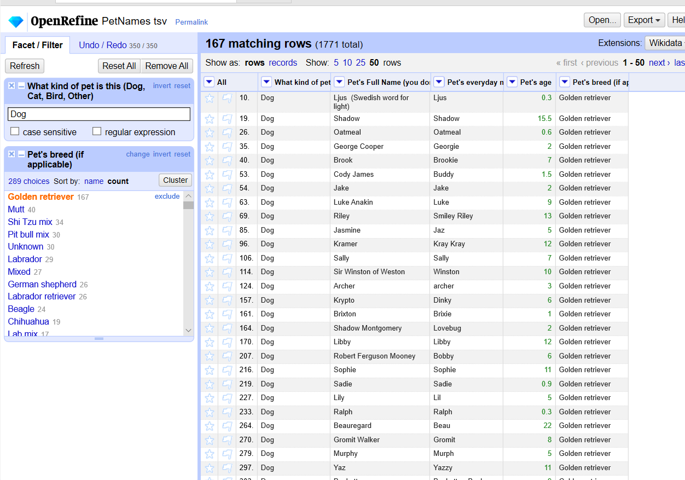

CS 625, Fall 2020

## Part 1: Data Cleaning

The dataset contains the details of different pets collected by Dr. Jen Golbeck from the responses to the Twitter posted on July 21, 2019. The raw dataset contains 1784 rows and 5 columns: __What kind of pet is this__, __pet's full name__, __pet's everyday name__, __pet's age__ and __pet's bread__.

In this homework, the data is cleaned using OpenRefine, and this report details the steps followed for cleaning. The data is imported into OpenRefine using the GitHub link as shown in the below figure.


### Column: "What kind of pet is this"

Text facet is used to find the count of values and there are 69 choices as shown in below figure


First, __cluster and edit__ feature is used to combine some of the choices which have similar names as shown in below figure  


Below steps are followed to clean the names using the text facet.

1. __Beta fish__ is changed to __Betta fish__ due to spell differences and the change is made manually as it requires only one change.

2. __Betta Fish__ is a type of fish and misplaced in __What kind of pet is this__. Moreover, __Fish__ was placed in __Pet's Breed__ column. First, all the values in the __Pet's Breed__ cells are changed to __Betta Fish__ using below __GREL__ commands.

      ```r
      if(not(value=="test"),'Betta Fish',value)
      ```

3. In the next step, __Betta fish__ is renamed to Fish in __What kind of pet is this__

4. The __Ca__ and __Car__ names are changed to __Cat__

5. __Card Board Poster__ is removed because it is not a pet.

6. __Cats__ has multiple pets and __Split multi-valued cells__ feature is used to split into multiple rows. 

7. __Chincilla (other)__ is changed to __Chinchilla__ Manually

8. __dlg__, __god__, __Dig__, and __Doggo__ are changed to __Dog__ because the __Pet's Breed__ in this choice is the name of a dog breed.

9. __dog,dog,dog,cat__ is spitted into multiple rows as it contains 4 pets in a single row.

10. __Goldfish__ is placed in __What kind of pet is this__ instead of in __Pet's breed__ similar to __Betta Fish__. GREL commands are used to fill __Goldfish__ in __Pet's breed__ and the name is changed to __Fish__ in __What kind of pet is this__

      ```r
      if(not(value=="test"),'Goldfish',value)
      ```

11. __Katze__, __Kitten__ and __Kitty Meow__ are different names of a cat in different languages and they are changed to __Cat__

12. __Luna__ is removed as it does not belong to any pet.

13. Following conversion are made based on the information in the other columns.

*   __Mona__ to __Dog__.

*   __Phoebe__ to __Dog__.

*   __Pit bull__ to __Dog__.

*   __Puppy__ to __Dog__.

*   __Roomba__ to __Robot__.

*   __Server__ to __Other__.

*   __Sog__ to __Dog__.

*   __(Other (fish))__ to __Fish__.

*   __Other- guinea pig__ to __guinea pig__.

*   __Other: bees__ to __Bees__.

*   __Other: prairie dog__ to __dog__.

*   __Other: snake__ -> __Snake__

14. __Leopard gecko__ is the breed name for lizard and it is renamed as __Lizard__.

15. Some of the electronics like __Rhoomba__ are clustered into Unknown and they are removed as they are not pets.

### Pet's Full Name & Pet's everyday name

The pet names are unique and there can be differences in spelling. Limited operations are used to clean the data in these columns. For __Pet's Full name__,  __cluster and edit__ is used to combine names which has a difference in the letter case. Merging is done using two __Keying Function__ types: __fingerprint__ and __ngram-fingerprint__. Similarly, merging for __Pet's everyday name__ column is made using __cluster and edit__ and cell values with __null__ are modified to __Unknown__

### Pet's age

To visualize the details of choices in this column, __Numeric facet__ is used and it contains __Non-Numeric__ values. To visualize choices in the __Non-numeric__ values, __Text Facet__ is used as shown in the below figure


Steps followed for cleaning the values in this column is listed below:

1. To combine some of the values, __cluster and Edit__ is used and merged as shown in the below figure.


2. Some values have years and special characters. They are removed using below GREL commands executed one after the other.

      ```r
      value.replace("years","").replace("year","").replace("ish","").replace("yesrs","").replace("?","").replace(" ","").replace("½",".5")
      value.replace("old","").replace("1/2",".5")
      ```
3. After the above operation, some of the numerical values are considered as a string. These values are converted to numbers using __Edit cells -> Common transforms -> To number__.       

4. Months are converted to year using below GREL commands

      ```r
      toNumber(value.replace("months","").replace("month","").replace("mos","").replace("mo","").replace(" ",""))/12.0
      ```
5. Weeks are converted to year using below GREL commands

      ```r
      toNumber(value.replace("weeks","").replace("week",""))/52.0
      ```
6. Some cells are blank and null and they are converted to __Unknown__ using below GREL command

      ```r
      if(or(value=="",value==null),'Unknown',value)
      ```

7. Some values have numbers in text format and they are converted to numeric values as shown below

      ```r
      toNumber(value.replace("Seven","7.0").replace("Six","6.0").replace("Two","2.0").replace("Eight","8").replace("yrs",""))
      ```

8. Some of the values in __Non-Numeric__ are edited manually based on my intuition. For example __3-4__ is converted to average age __3.5__

9. From the above modification, the one of the pets has an age of 910 years. The initial data shows the pet age is __9-10__ and it is manually changed to __9.5__

10. Final numeric values of age contain long decimal points and they are changed to one decimal point using the below command.


      ```r
      toNumber(value.toString("%.1f"))
      ```

11. All the strings are converted to numbers using __Edit cells -> Common transforms -> To number__ operation.

### Pet's breed:

To visualize the choice under __Pet' breed__, text Facet is used and there are 734 choices as shown in the below figure.


Some of the values in __Pet's breed__ are very similar as shown in the below figure.


The selected choices in the above figure are converted to a single name using below GREL code. 

```r
if(not(value=="test"),"Mixed",value)
```

Below is the GREL command I have used to combine the pet's breed with a similar names.

```r
if(not(value=="test"),"Mutt",value)
if(not(value=="test"),"Pit bull mix",value)
if(not(value=="test"),"Pomeranian mix",value)
if(not(value=="test"),"Poodle mix",value)
if(not(value=="test"),"Pug",value)
if(not(value=="test"),"Rottweiler mix",value)
if(not(value=="test"),"Russian dwarf hamster",value)
if(not(value=="test"),"Shepherd mix",value)
if(not(value=="test"),"Shi Tzu mix",value)
if(not(value=="test"),"Short haired",value)
if(not(value=="test"),"Yorkshire",value)
if(not(value=="test"),"Labrador",value)
if(not(value=="test"),"West highland white terrier",value)
if(not(value=="test"),"Tuxedo cat",value)
if(not(value=="test"),"Tortie cat",value)
if(not(value=="test"),"Tabby cat",value)
if(not(value=="test"),"Syrian hamster",value)
```

The entire data cleaning of all the columns took around 350 operations. 

## Part 2

In this part, the cleaned data is used to answer the below questions.

### 1. How many types (kinds) of pets are there?

Text facet is used to visualize different kinds of pets and the number of pets is __27__ as shown in the below figure.


### 2. How many dogs?

The text facet shows that the number of dogs is __1128__ as shown in the below figure.


### 3. How many breeds of dogs?

Dogs are filtered using __Text Filter__ and __Text facet__ features to find the number of dog breeds. There are __289__ dog breeds as shown in the below figure.


### 4. What's the most popular dog breed?

The most popular dog breed is __Golden retriver__.


### 5. What's the age range of the dogs?

The data of dogs are sorted based on __Pet's age__ and the maximum age of a dog is __22__ and the minimum age of a dog is almost __0__.

.PNG)

.PNG)


### 6. What's the age range of the guinea pigs?

The age range of guinea pigs is between __1-5__.


### 7. What is the oldest pet?

The oldest pet is __Cat__ with an age of __24__.


### 8. Which are more popular, betta fish or goldfish? How many of each?

The __betta fish__ is more popular than __goldfish__. There are __13 betta fishes__ and __9 goldfishes__ 


### 9. What's the most popular everyday name for a cat?

The most popular everyday cat name is __Kitty__ as shown in the below figure.


### 10. What's the most popular full name for a dog?

The most popular full name of the dog is __Maggie__ and __Sadie__.


## References

1. Post used to collect the pet details: https://twitter.com/jengolbeck/status/1153062825566375940
2. Data source from github: https://github.com/jgolbeck/petnames
3. OpenRefine Tutorial:
http://web.archive.org/web/20190105063215/enipedia.tudelft.nl/wiki/OpenRefine_Tutorial
4. General Refine Expression Language (GREL) reference : https://github.com/OpenRefine/OpenRefine/wiki/General-Refine-Expression-Language
