Homework 2
================
Triveni Sangama Saraswathi Edla

CS 625, Fall 2020

## Part 1: Data Cleaning

The dataset contains the details of different pets collected by Dr. Jen
Golbeck from the responses to the Twitter posted on July 21, 2019. The
raw dataset contains 1784 rows and 5 columns: **What kind of pet is
this**, **pet’s full name**, **pet’s everyday name**, **pet’s age** and
**pet’s bread**.

In this homework, the data is cleaned using OpenRefine, and this report
details the steps followed for cleaning. The data is imported into
OpenRefine using the GitHub link as shown in the below figure.

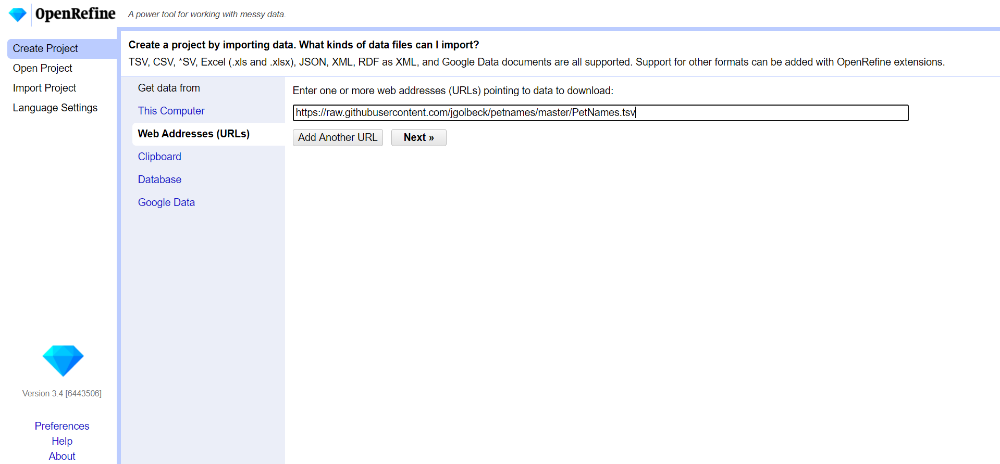

### Column: “What kind of pet is this”

Text facet is used to find the count of values and there are 69 choices
as shown in below figure

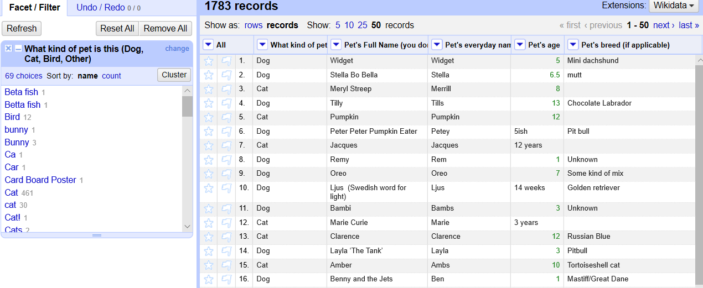

First, **cluster and edit** feature is used to combine some of the
choices which have similar names as shown in below figure


Below steps are followed to clean the names using the text facet.

1.  **Beta fish** is changed to **Betta fish** due to spell differences
    and the change is made manually as it requires only one change.

2.  **Betta Fish** is a type of fish and misplaced in **What kind of pet
    is this**. Moreover, **Fish** was placed in **Pet’s Breed** column.
    First, all the values in the **Pet’s Breed** cells are changed to
    **Betta Fish** using below **GREL** commands.
    
    ``` r
    if(not(value=="test"),'Betta Fish',value)
    ```

3.  In the next step, **Betta fish** is renamed to Fish in **What kind
    of pet is this**

4.  The **Ca** and **Car** names are changed to **Cat**

5.  **Card Board Poster** is removed because it is not a pet.

6.  **Cats** has multiple pets and **Split multi-valued cells** feature
    is used to split into multiple rows.

7.  **Chincilla (other)** is changed to **Chinchilla** Manually

8.  **dlg**, **god**, **Dig**, and **Doggo** are changed to **Dog**
    because the **Pet’s Breed** in this choice is the name of a dog
    breed.

9.  **dog,dog,dog,cat** is spitted into multiple rows as it contains 4
    pets in a single row.

10. **Goldfish** is placed in **What kind of pet is this** instead of in
    **Pet’s breed** similar to **Betta Fish**. GREL commands are used to
    fill **Goldfish** in **Pet’s breed** and the name is changed to
    **Fish** in **What kind of pet is this**
    
    ``` r
    if(not(value=="test"),'Goldfish',value)
    ```

11. **Katze**, **Kitten** and **Kitty Meow** are different names of a
    cat in different languages and they are changed to **Cat**

12. **Luna** is removed as it does not belong to any pet.

13. Following conversion are made based on the information in the other
    columns.

<!-- end list -->

  - **Mona** to **Dog**.

  - **Phoebe** to **Dog**.

  - **Pit bull** to **Dog**.

  - **Puppy** to **Dog**.

  - **Roomba** to **Robot**.

  - **Server** to **Other**.

  - **Sog** to **Dog**.

  - **(Other (fish))** to **Fish**.

  - **Other- guinea pig** to **guinea pig**.

  - **Other: bees** to **Bees**.

  - **Other: prairie dog** to **dog**.

  - **Other: snake** -\> **Snake**

<!-- end list -->

14. **Leopard gecko** is the breed name for lizard and it is renamed as
    **Lizard**.

15. Some of the electronics like **Rhoomba** are clustered into Unknown
    and they are removed as they are not pets.

### Pet’s Full Name & Pet’s everyday name

The pet names are unique and there can be differences in spelling.
Limited operations are used to clean the data in these columns. For
**Pet’s Full name**, **cluster and edit** is used to combine names which
has a difference in the letter case. Merging is done using two **Keying
Function** types: **fingerprint** and **ngram-fingerprint**. Similarly,
merging for **Pet’s everyday name** column is made using **cluster and
edit** and cell values with **null** are modified to **Unknown**

### Pet’s age

To visualize the details of choices in this column, **Numeric facet** is
used and it contains **Non-Numeric** values. To visualize choices in the
**Non-numeric** values, **Text Facet** is used as shown in the below
figure

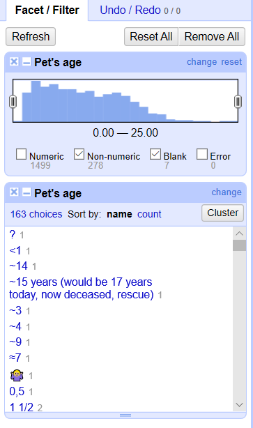

Steps followed for cleaning the values in this column is listed below:

1.  To combine some of the values, **cluster and Edit** is used and
    merged as shown in the below figure.

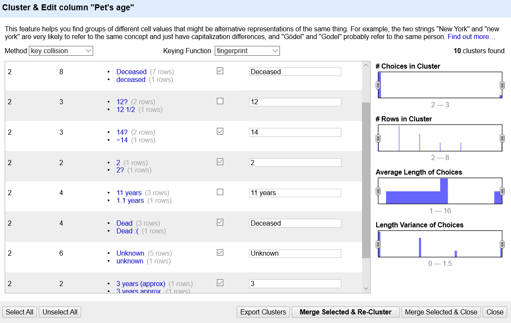

2.  Some values have years and special characters. They are removed
    using below GREL commands executed one after the other.
    
    ``` r
    value.replace("years","").replace("year","").replace("ish","").replace("yesrs","").replace("?","").replace(" ","").replace("½",".5")
    value.replace("old","").replace("1/2",".5")
    ```

3.  After the above operation, some of the numerical values are
    considered as a string. These values are converted to numbers using
    **Edit cells -\> Common transforms -\> To number**.

4.  Months are converted to year using below GREL commands
    
    ``` r
    toNumber(value.replace("months","").replace("month","").replace("mos","").replace("mo","").replace(" ",""))/12.0
    ```

5.  Weeks are converted to year using below GREL commands
    
    ``` r
    toNumber(value.replace("weeks","").replace("week",""))/52.0
    ```

6.  Some cells are blank and null and they are converted to **Unknown**
    using below GREL command
    
    ``` r
    if(or(value=="",value==null),'Unknown',value)
    ```

7.  Some values have numbers in text format and they are converted to
    numeric values as shown below
    
    ``` r
    toNumber(value.replace("Seven","7.0").replace("Six","6.0").replace("Two","2.0").replace("Eight","8").replace("yrs",""))
    ```

8.  Some of the values in **Non-Numeric** are edited manually based on
    my intuition. For example **3-4** is converted to average age
    **3.5**

9.  From the above modification, the one of the pets has an age of 910
    years. The initial data shows the pet age is **9-10** and it is
    manually changed to **9.5**

10. Final numeric values of age contain long decimal points and they are
    changed to one decimal point using the below command.
    
    ``` r
    toNumber(value.toString("%.1f"))
    ```

11. All the strings are converted to numbers using **Edit cells -\>
    Common transforms -\> To number** operation.

### Pet’s breed:

To visualize the choice under **Pet’ breed**, text Facet is used and
there are 734 choices as shown in the below figure.

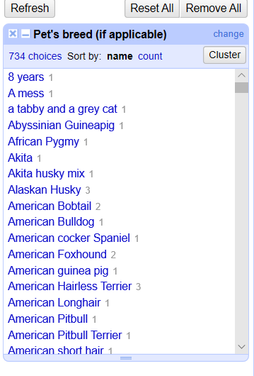

Some of the values in **Pet’s breed** are very similar as shown in the
below figure.

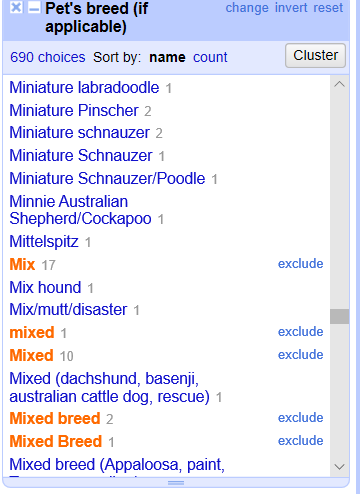

The selected choices in the above figure are converted to a single name
using below GREL code.

``` r
if(not(value=="test"),"Mixed",value)
```

Below is the GREL command I have used to combine the pet’s breed with a
similar names.

``` r
if(not(value=="test"),"Mutt",value)
if(not(value=="test"),"Pit bull mix",value)
if(not(value=="test"),"Pomeranian mix",value)
if(not(value=="test"),"Poodle mix",value)
if(not(value=="test"),"Pug",value)
if(not(value=="test"),"Rottweiler mix",value)
if(not(value=="test"),"Russian dwarf hamster",value)
if(not(value=="test"),"Shepherd mix",value)
if(not(value=="test"),"Shi Tzu mix",value)
if(not(value=="test"),"Short haired",value)
if(not(value=="test"),"Yorkshire",value)
if(not(value=="test"),"Labrador",value)
if(not(value=="test"),"West highland white terrier",value)
if(not(value=="test"),"Tuxedo cat",value)
if(not(value=="test"),"Tortie cat",value)
if(not(value=="test"),"Tabby cat",value)
if(not(value=="test"),"Syrian hamster",value)
```

The entire data cleaning of all the columns took around 350 operations.

## Part 2

In this part, the cleaned data is used to answer the below questions.

### 1\. How many types (kinds) of pets are there?

Text facet is used to visualize different kinds of pets and the number
of pets is **27** as shown in the below figure.

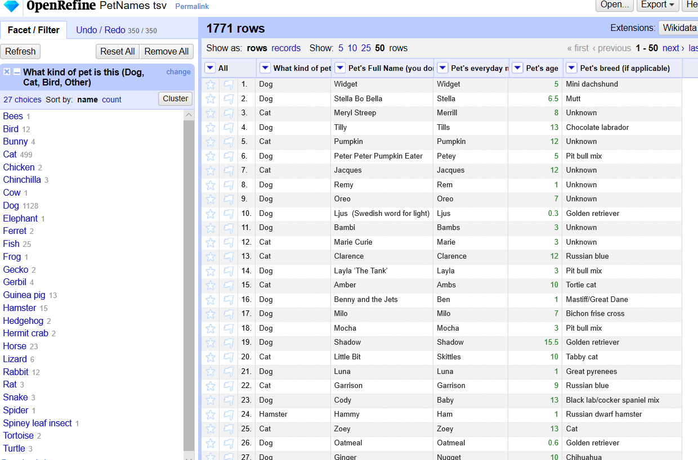

### 2\. How many dogs?

The text facet shows that the number of dogs is **1128** as shown in the
below figure.

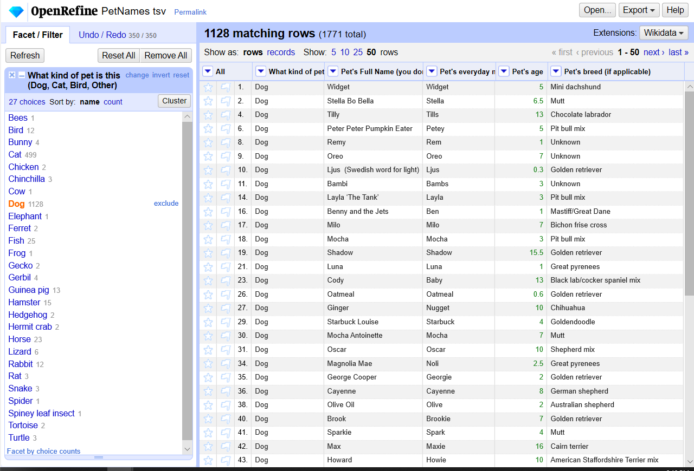

### 3\. How many breeds of dogs?

Dogs are filtered using **Text Filter** and **Text facet** features to
find the number of dog breeds. There are **289** dog breeds as shown in
the below figure.

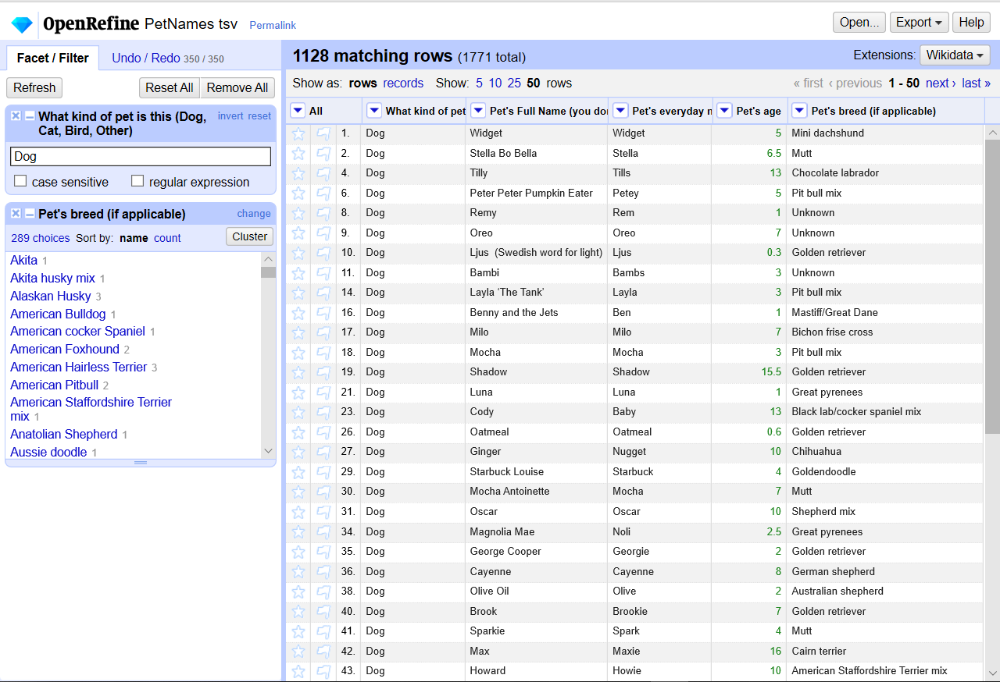

### 4\. What’s the most popular dog breed?

The most popular dog breed is **Golden retriver**. 

### 5\. What’s the age range of the dogs?

The data of dogs are sorted based on **Pet’s age** and the maximum age
of a dog is **22** and the minimum age of a dog is almost **0**.

.PNG)

.PNG)

### 6\. What’s the age range of the guinea pigs?

The age range of guinea pigs is between **1-5**.

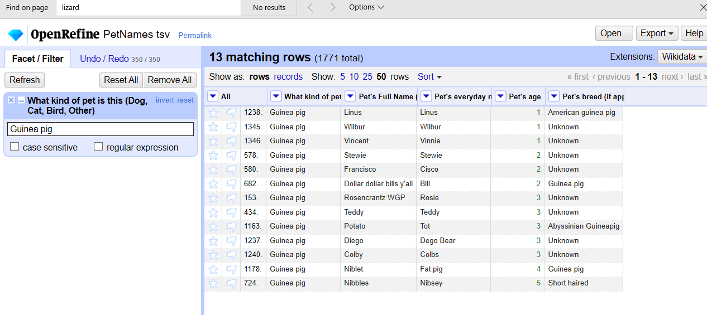

### 7\. What is the oldest pet?

The oldest pet is **Cat** with an age of **24**.

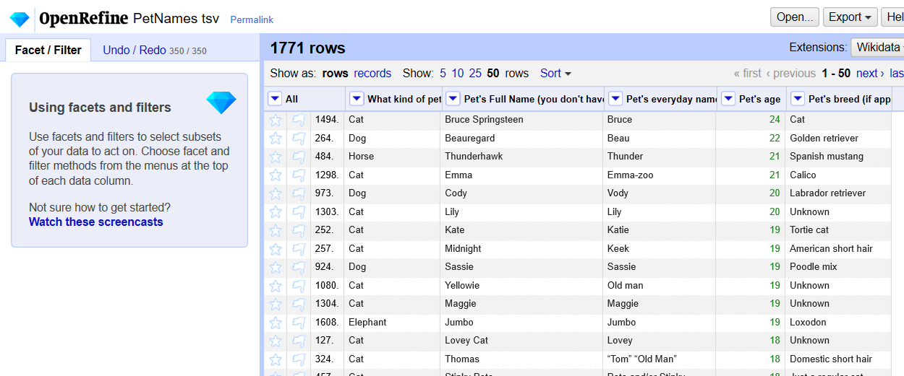

### 8\. Which are more popular, betta fish or goldfish? How many of each?

The **betta fish** is more popular than **goldfish**. There are **13
betta fishes** and **9 goldfishes**

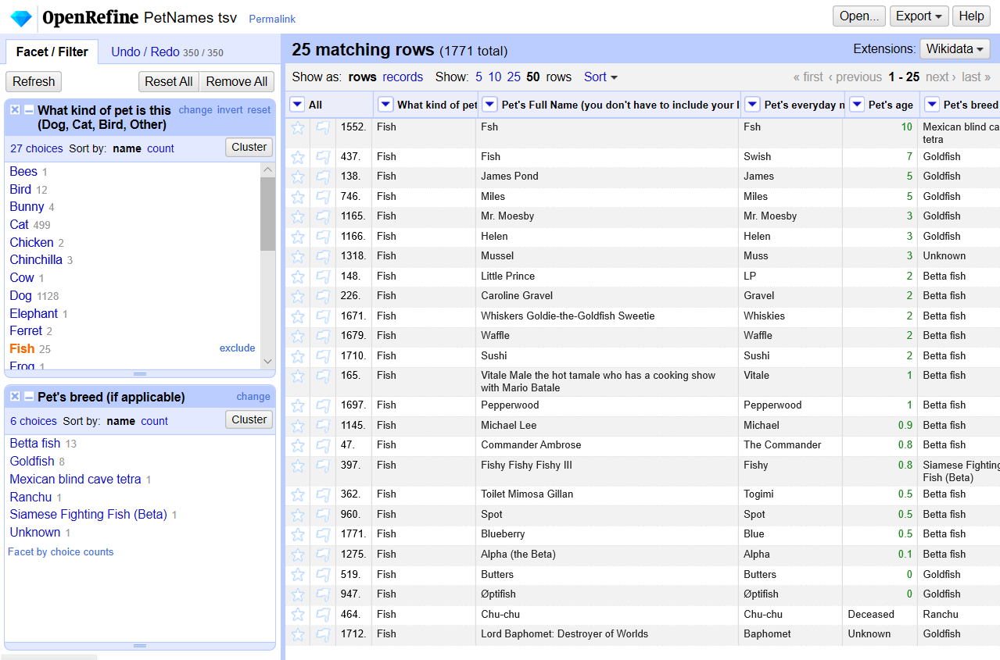

### 9\. What’s the most popular everyday name for a cat?

The most popular everyday cat name is **Kitty** as shown in the below
figure.

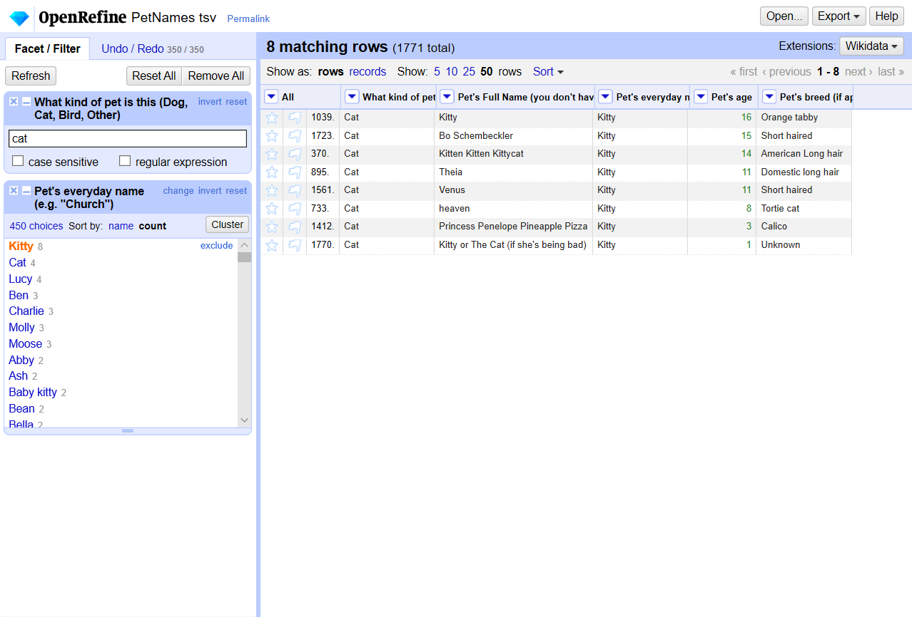

### 10\. What’s the most popular full name for a dog?

The most popular full name of the dog is **Maggie** and **Sadie**.

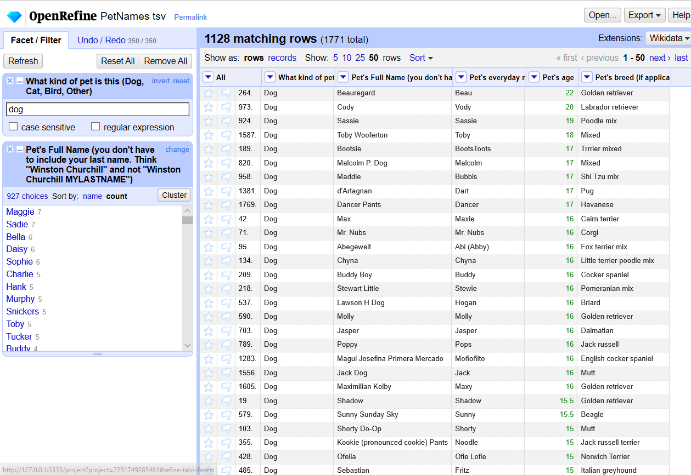

## References

1.  Post used to collect the pet details:
    <https://twitter.com/jengolbeck/status/1153062825566375940>
2.  Data source from github: <https://github.com/jgolbeck/petnames>
3.  OpenRefine Tutorial:
    <http://web.archive.org/web/20190105063215/enipedia.tudelft.nl/wiki/OpenRefine_Tutorial>
4.  General Refine Expression Language (GREL) reference :
    <https://github.com/OpenRefine/OpenRefine/wiki/General-Refine-Expression-Language>
