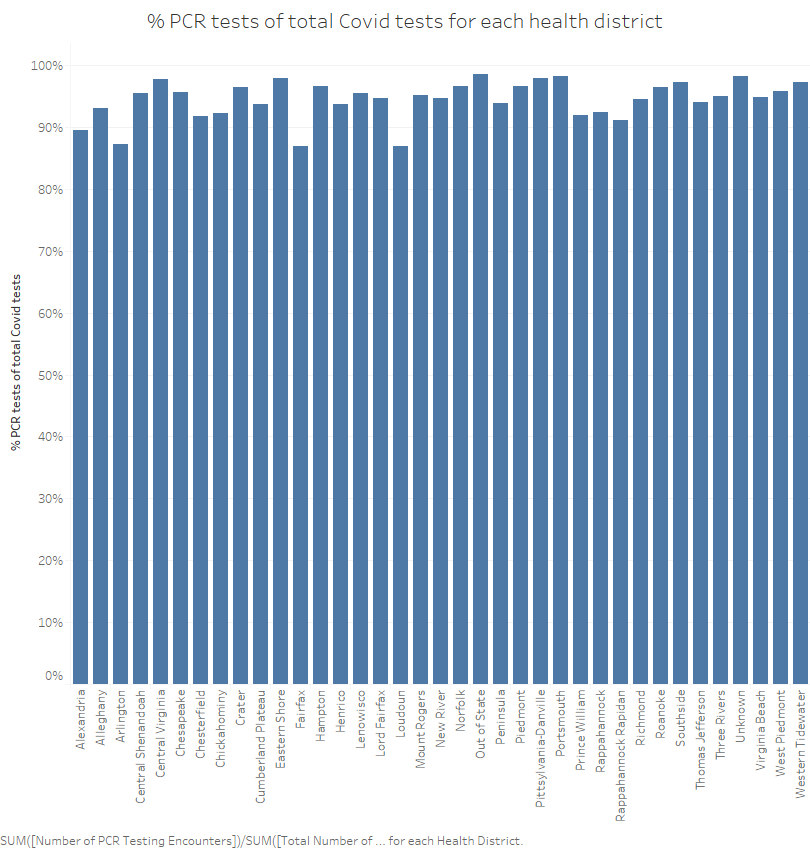
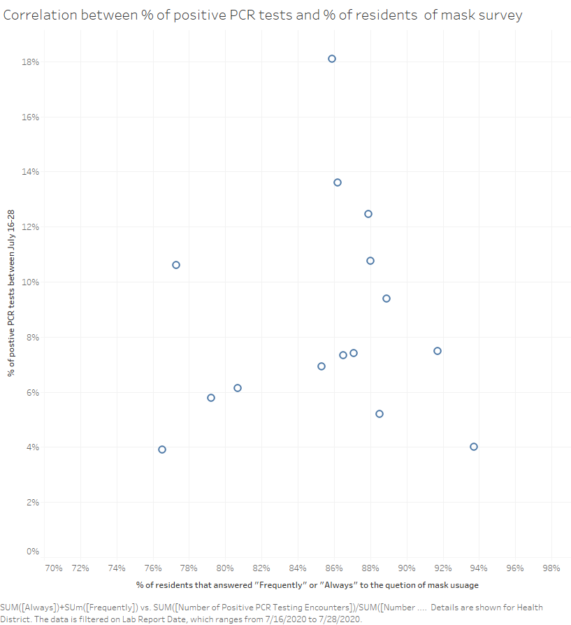
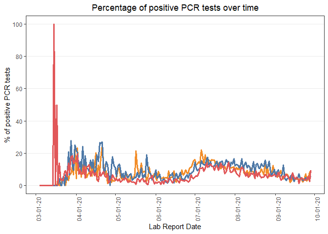
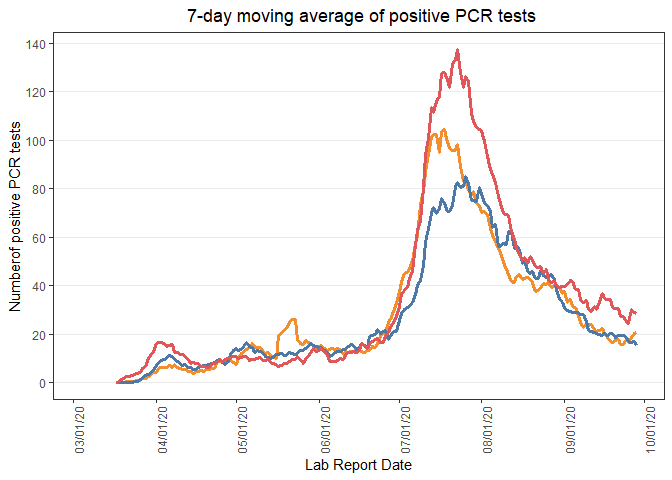
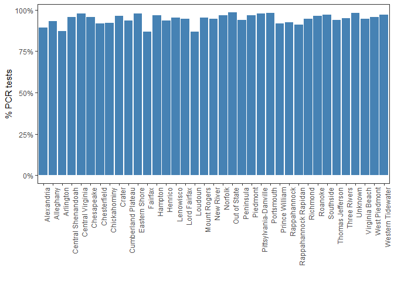
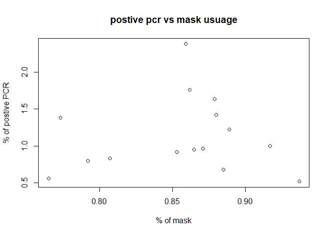

Homework 3
================
Triveni Sangama Saraswathi Edla

CS 625, Fall 2020

## Part 1 - Using Tableu

In this homework, the public use Covid-19 data from the [Virginia
Department of Health’s COVID-19
Dataset](https://www.vdh.virginia.gov/coronavirus/) is examined. The
dataset contains the number of total tests and the number of positive
PCR tests. In this part, the data is visualized using Tableau due to its
excellent drag and drop options and other features that help in
generating visualization within minutes.

#### 1.\[VDH\] How does the percentage of positive PCR tests over time compare for Norfolk, Chesapeake, and Virginia Beach?

The comparison of the percentage of positive PCR tests over time for
Norfolk, Chesapeake, and Virginia Beach is plotted using the line plot.
The attributed plotted on the x-axis is **Lab Report Date** and the
ratio between **Number of Positive PCR Testing Encounters**, **Number of
PCR Testing Encounters** is plotted on the y-axis. The variation of the
percentage of positive PCR tests for Norfolk, Chesapeake, Virginia Beach
is represented by Orange, Blue, and Red color respectively.


From the above line chart, it can be observed that there is a peak in
the Virginia beach data in early March. Overall for all the health
districts plotted, there are high fluctuations in the variation of the
percentage of positive PCR tests.

#### 7-day moving average

 The above
plot shows the 7-day moving average of positive PCR tests over time
using line plots the same color markers used in the previous line plot
is used. . **Lab Report Date** is plotted on the x-axis and the 7-day
average of percentage CR tests measured value is plotted. From the above
plot, it is observed that the number of positive PCR tests reaches a
peak around mid-July in all the cities. However, the Virginia beach has
high number of cases compared to other cities.

#### 2\. \[VDH\] For each health district, what percentage of the total tests given were PCR tests?

The comparisons of the percentage of PCR tests of total tests are
plotted using a bar chart with **Health District** attribute on the
x-axis and the ratio between **Number of PCR Testing Encounters**,
**Total Number of Testing Encounters** attributes is plotted on the
y-axis.



The above bar chart shows the percentage of PCR tests of total COVID
tests for each health district and all the districts have similar
values.

#### 3.\[VDH, NYT\] Was there a correlation between the percentage positive PCR tests averaged over July 16-28 (two weeks after the mask survey) and the estimated share of residents that answered “Frequently” or “Always” to the question of mask usage?

#### Show this for the following 15 health districts only: Norfolk, Virginia Beach, Chesapeake, Portsmouth, Hampton, Western Tidewater, Peninsula, Fairfax, Arlington, Prince William, Richmond, Henrico, Chesterfield, Roanoke, Central Shenandoah.

#### For health districts that span multiple counties, pick the county with the highest population for the mask survey and name the county that you’re considering.

The [Mask-Wearing Survey
Data](https://github.com/nytimes/covid-19-data/tree/master/mask-use)
dataset contains the answers given by the public for the mask questions
in various counties represented by [county-level FIPS
codes](https://www.nrcs.usda.gov/wps/portal/nrcs/detail/?cid=nrcs143_013697).
The dataset does not have the county names and they are added to the
dataset using the data from USDA website. For this purpose **Vlookup**
feature in Microsoft Excel is used.

The VDH COVID dataset contains the data of different health districts in
Virginia whereas the **Mask-Wearing Survey** dataset has counties. To
plot the correlation between **percentage of positive PCR tests** and
the estimated share of residents that answered **Frequently** or
**Always** to the mask survey, the **Health District** attribute values
needs to be similar. The data of counties with maximum population, for
each **Health District**, in the VDH dataset is selected and the
remaining data is deleted manually in Microsoft Excel. It is assumed
that these counties represent the data of the **Health District**. The
Counties considered for some of the **Health District** are shown below.

**Norfolk**: **Norfolk city**

**Virginia Beach**: **Virginia Beach city**

**Chesapeake**: **Chesapeake**

**Portsmouth**: **Portsmouth**

**Fairfax**: **Fairfax City**

**Western tide water**: **Suffolk city**

**peninsula**: **Newport news**

**Richmond**: **Richmond city**

**Roanoke**: **Roanoke city**

**Central shenandoah**: **Rockingham**

**Hampton**: **Hampton city**



The correlation between **percentage of positive PCR tests** and the
estimated share of residents that answered **Frequently** or **Always**
to the mask survey, is plotted using scatter plot. Circles are used as
markers to represent each datapoint with blue color. The **percentage of
positive PCR tests** is on the y-axis and the mask survey response is on
the x-axis.It is observed that there is a negative correlation between
the two attributes

**Norfolk**: **Norfolk city**

**Virginia Beach**: **Virginia Beach city**

**Fairfax**: **Fairfax City**

**Western tide water**: **Suffolk city**

**peninsula**: **Newport news**

**Richmond**: **Richmond city**

**Roanoke**: **Roanoke city**

**Central shenandoah**: **Rockingham**

**Hampton**: **Hampton city**

## Part 2 - Using Programming Language/API:

In this part, R is used to replicate the visualizations plotted in
Part-1.

``` r
library(tidyverse)
```

    ## -- Attaching packages --------------------------------------- tidyverse 1.3.0 --

    ## v ggplot2 3.3.2     v purrr   0.3.4
    ## v tibble  3.0.4     v dplyr   1.0.2
    ## v tidyr   1.1.2     v stringr 1.4.0
    ## v readr   1.4.0     v forcats 0.5.0

    ## -- Conflicts ------------------------------------------ tidyverse_conflicts() --
    ## x dplyr::filter() masks stats::filter()
    ## x dplyr::lag()    masks stats::lag()

``` r
VDH_covid_data <- read.csv(file = 'VDH-COVID-19-PublicUseDataset-Tests_by-LabReportDate.csv')
VDH_covid_data$Lab.Report.Date <- as.Date(VDH_covid_data$Lab.Report.Date, "%m/%d/%Y")


library(ggplot2)

linesize <- 1.25

p = ggplot() +
  
  geom_line(data = subset(VDH_covid_data, Health.District == "Norfolk"),aes(x = Lab.Report.Date, y = 100*Number.of.Positive.PCR.Testing.Encounters/Number.of.PCR.Testing.Encounters), color = "#F28E2B",size=linesize) +
  
  geom_line(data = subset(VDH_covid_data, Health.District == "Chesapeake"), aes(x = Lab.Report.Date, y = 100*Number.of.Positive.PCR.Testing.Encounters/Number.of.PCR.Testing.Encounters), color = "#4E79A7",size=linesize)+
  
  geom_line(data = subset(VDH_covid_data, Health.District == "Virginia Beach"), aes(x = Lab.Report.Date, y = 100*Number.of.Positive.PCR.Testing.Encounters/Number.of.PCR.Testing.Encounters), color = "#E15759",size=linesize)

p<-p+geom_line() +labs(x = "Lab Report Date",y = "% of positive PCR tests",title = "Percentage of positive PCR tests over time",family="-apple-system,BlinkMacSystemFont,Segoe UI,Helvetica,Arial,sans-serif,Apple Color Emoji,Segoe UI Emoji",face =c("plain"))

p<-p+theme_bw()


p<-p+scale_x_date(date_labels = "%m-%d-%y",breaks = seq(from=as.Date("2020/3/1"), by="month",length.out=8))+
  theme(axis.text.x = element_text(angle=90, hjust = 2),panel.grid.major.x = element_blank(),panel.grid.minor.x = element_blank(),plot.title = element_text(face = "plain",hjust = 0.5))+
  scale_y_continuous(breaks=seq(0,100,20),minor_breaks = seq(0,100,20))
p
```

    ## Warning: Removed 1 row(s) containing missing values (geom_path).
    
    ## Warning: Removed 1 row(s) containing missing values (geom_path).
    
    ## Warning: Removed 1 row(s) containing missing values (geom_path).

<!-- -->

``` r
library(ggplot2)
library(tidyverse)
library(tidyquant) 
```

    ## Loading required package: lubridate

    ## 
    ## Attaching package: 'lubridate'

    ## The following objects are masked from 'package:base':
    ## 
    ##     date, intersect, setdiff, union

    ## Loading required package: PerformanceAnalytics

    ## Loading required package: xts

    ## Loading required package: zoo

    ## 
    ## Attaching package: 'zoo'

    ## The following objects are masked from 'package:base':
    ## 
    ##     as.Date, as.Date.numeric

    ## 
    ## Attaching package: 'xts'

    ## The following objects are masked from 'package:dplyr':
    ## 
    ##     first, last

    ## 
    ## Attaching package: 'PerformanceAnalytics'

    ## The following object is masked from 'package:graphics':
    ## 
    ##     legend

    ## Loading required package: quantmod

    ## Loading required package: TTR

    ## Registered S3 method overwritten by 'quantmod':
    ##   method            from
    ##   as.zoo.data.frame zoo

    ## Version 0.4-0 included new data defaults. See ?getSymbols.

    ## == Need to Learn tidyquant? ====================================================
    ## Business Science offers a 1-hour course - Learning Lab #9: Performance Analysis & Portfolio Optimization with tidyquant!
    ## </> Learn more at: https://university.business-science.io/p/learning-labs-pro </>

``` r
linesize <- 1.25

p = ggplot() + 
  geom_ma(data = subset(VDH_covid_data, Health.District == "Norfolk"),aes(x = Lab.Report.Date, y = Number.of.Positive.PCR.Testing.Encounters), color = "#F28E2B",size=linesize,n=7,linetype=1) +
  geom_ma(data = subset(VDH_covid_data, Health.District == "Chesapeake"), aes(x = Lab.Report.Date, y = Number.of.Positive.PCR.Testing.Encounters), color = "#4E79A7",size=linesize,n=7,linetype=1)+
  geom_ma(data = subset(VDH_covid_data, Health.District == "Virginia Beach"), aes(x = Lab.Report.Date, y = Number.of.Positive.PCR.Testing.Encounters), color = "#E15759",size=linesize,n=7,linetype=1)

p<-p+geom_line() +labs(x = "Lab Report Date",y = "Numberof positive PCR tests",title = " 7-day moving average of positive PCR tests",family="-apple-system,BlinkMacSystemFont,Segoe UI,Helvetica,Arial,sans-serif,Apple Color Emoji,Segoe UI Emoji",face =c("plain"))

p<-p+theme_bw()


p<-p+scale_x_date(date_labels = "%m/%d/%y",breaks = seq(from=as.Date("2020/3/1"), by="month",length.out=8))+
  theme(axis.text.x = element_text(angle=90, hjust = 2),panel.grid.major.x = element_blank(),panel.grid.minor.x = element_blank(),plot.title = element_text(face = "plain",hjust = 0.5))+
  scale_y_continuous(breaks=seq(0,140,20),minor_breaks = seq(0,140,20))

p
```

<!-- -->

``` r
districts <- distinct(VDH_covid_data,Health.District)
districts <- districts$Health.District

prcntpcr <- c()
  
for (district in districts)

  {
  
  dum <- subset(VDH_covid_data, Health.District == district)
  
  dumprcnt <- sum(dum$Number.of.PCR.Testing.Encounters)/sum(dum$Total.Number.of.Testing.Encounters)

  prcntpcr <- append(prcntpcr,dumprcnt)

}

df_prcnt <- data.frame(Health.District=districts,prcntpcr=prcntpcr)

p<-ggplot(data=df_prcnt, aes(x=Health.District, y=prcntpcr)) +
  geom_bar(stat="identity",fill="steelblue")

p<-p+theme_bw()

p<-p+ theme(axis.text.x = element_text(angle=90, hjust = 1.0),
            panel.grid.major.x = element_blank(),
            panel.grid.minor.x = element_blank(),
            panel.grid.major.y = element_blank(),
            panel.grid.minor.y = element_blank(),
            plot.title = element_text(face = "plain",hjust = 1.0))

p<-p+scale_y_continuous(labels=scales::percent)
p<-p+xlab("")
p<-p+ylab("% PCR tests")

p
```

<!-- -->

In the below code the visualization for question 3 is replicated. The
code automates such that the original mask data is used and required
counties are filtered using the IFPS codes.

``` r
districts <- c("Arlington","Central Shenandoah","Chesapeake","Chesterfield","Fairfax","Hampton","Henrico","Norfolk","Peninsula","Portsmouth","Prince William","Richmond","Roanoke","Virginia Beach","Western Tidewater")

IFPS_codes <- c(51013,51165,51550,51041,51600,51650,51087,51710,51700,51740,51153,51159,51770,51810,51800)


prcntpcr <- c()
  
for (district in districts)
{
  dum <- subset(VDH_covid_data, Health.District == district)
  dum <- dum[dum$Lab.Report.Date >= "2020-07-16" & dum$Lab.Report.Date <= "2020-07-28",]

    
  # dumprcnt <- sum(dum$Number.of.Positive.PCR.Testing.Encounters,na.rm=T)/sum(dum$Number.of.PCR.Testing.Encounters,na.rm=T)
  
dumprcnt <- sum(dum$Number.of.Positive.PCR.Testing.Encounters/dum$Number.of.PCR.Testing.Encounters,na.rm=T)

  
    prcntpcr <- append(prcntpcr,dumprcnt)

}

mask_data <- read.csv(file = 'mask-use-by-county.csv')

prcntmask <- c()
  
for (code in IFPS_codes)
{
  dum <- subset(mask_data, COUNTYFP == code)
  dumprcnt <- dum$FREQUENTLY+dum$ALWAYS
  

  prcntmask <- append(prcntmask,dumprcnt)
}


plot(x = prcntmask,y = prcntpcr,
   xlab = "% of mask",
   ylab = "% of postive PCR",
   main = "postive pcr vs mask usuage"
)
```

<!-- -->

The plots visualized using R are similar to the plots from Tableau.
Tableau was a simple tool that can be used to generate visualizations
efficiently. However, for the 3rd question, the manipulation is
conducted manually in Excel whereas the process is automated. For large
datasets, manual manipulation is difficult and R can automate the
process.

## References

  - United States Department of Agriculture:
    <https://www.nrcs.usda.gov/wps/portal/nrcs/detail/?cid=nrcs143_013697>
  - Virginia Department of Health:
    <https://www.vdh.virginia.gov/local-health-districts/>
