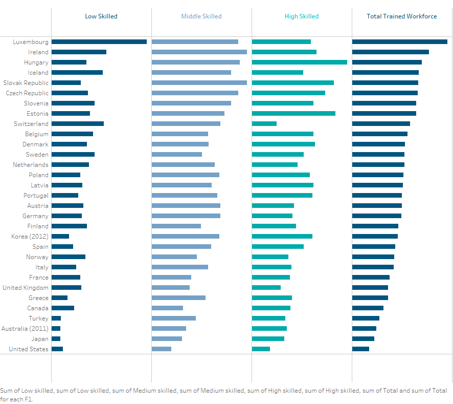

Homework 4
================
Triveni Sangama Saraswathi Edla

CS 625, Fall 2020

### Part 1 - Choose Excel, Tableau, R, or Vega-Lite:

### Using Excel:

In part1, the data set
<http://policyviz.com/wp-content/uploads/2018/02/PolicyViz_WSJ_Remake.xlsx>
is visualized using Excel and image: [line chart with multiple
lines](https://policyviz.com/wp-content/uploads/2018/02/PolicyViz_WSJ_Remake_LineChart-1024x613.png)
is recreated. The data set contains the percentage of families of White,
Black, Asian, and Hispanic with at least one member unemployed. Using
Excel, the line chart is used to analyze and observe the trend.


From the chart, the percent of families of black are more with
unemployment followed by Hispanic, White, and Asians.

**Steps:**

  - *Scatter with straight lines* option in excel is used to visualize
    the data using the line plot.

  - For adding labels in the sheet, click on the chart, select each
    line, right-click on it, select data, and format data label. On the
    right side, there will be an option of labels. In that select series
    name and value, which provides labels for all the lines.

  - The line markers for each category is used are *Red*, *Orange accent
    2*, *Blue Accent 1*, *Green* for Black, Hispanic, White, and Asians
    respectively.

  - Data legends are directly placed on each category.

In excel, the reference chart is exactly recreated.

Excel is an easy tool to summarize the data and the charts by
visualizing the patterns and trends. Excel is used in analyzing large
amounts of data within a small rectangular shape of the worksheet. I
felt excel is easy and friendly.

## Part 2 - Choose Tableau, R, or Vega-Lite (no Excel):

### Uisng Tableau:

In part2, the data set
<http://policyviz.com/wp-content/uploads/2017/11/PolicyViz_OECD_Skills_Data.xlsx>
is visualized using Tableau and image: [small
multiples](https://policyviz.com/wp-content/uploads/2017/11/PolicyViz_OECDStackedColumnChartRemake.png)
is recreated. The data set contains business sector jobs sustained by
foreign final demand, by skill intensity in the year 2014. The graph
*Small Multiples* of Tableau is used to analyze High skilled, Medium
skilled, Low skilled, and Total sector employment.




There are two data sets in the Excel sheet and charts are plotted for
both data sets using Tableau.

  - In the tableau, *Country* is selected as rows and *Low Skilled*,
    *Middle Skilled* , *High Skilled*, and *Total Trained Workforce* as
    columns for the horizontal bars chart.

  - All columns are selected twice and one of them is set into a
    dual-axis to generate a graph.

  - The color is changed for each column according to the reference
    chart provided.

  - Select the axis at the bottom, right-click and format the axis.

  - Guidelines are removed by decreasing the opacity. To do this, first,
    choose format and workbook. In the left panel, select grid lines and
    change the opacity to zero to remove the gridlines from the chart.

  - Each label is selected from the top of the chart which are *Low
    Skilled*, *Middle Skilled*, *High Skilled*, and *Total Trained
    Workforce* are changed to the appropriate colors according to the
    reference chart.

In Tableau, the option to change the length of bars and aligning the
axis text to left is not available.

Tableau is a powerful tool and it can generate beautiful visualizations.
There are many options available in Tableau which will enhance the user
experience. The beautiful part of Tableau is, without having coding
skills effective graphs can be developed unlike using Python, R, and
Vega-lite.

Link to Tableau workbook:
<https://prod-useast-a.online.tableau.com/#/site/oducs625/workbooks/251557/views>

\#\#Extra Credit: Using R

In this part, R is used to replicate the visualizations plotted in
Part-1.

``` r
library(tidyverse)
```

    ## -- Attaching packages ------------------------------------------------------------------------------------------ tidyverse 1.3.0 --

    ## v ggplot2 3.3.2     v purrr   0.3.4
    ## v tibble  3.0.3     v dplyr   1.0.2
    ## v tidyr   1.1.2     v stringr 1.4.0
    ## v readr   1.3.1     v forcats 0.5.0

    ## -- Conflicts --------------------------------------------------------------------------------------------- tidyverse_conflicts() --
    ## x dplyr::filter() masks stats::filter()
    ## x dplyr::lag()    masks stats::lag()

``` r
data <- read.csv(file = 'Book1_R.csv')


library(ggplot2)

linesize <- 1.25

p = ggplot() +
  
  geom_line(data = data,aes(x = X, y = Black), color = "Red",size=linesize) +
  
  geom_line(data = data,aes(x = X, y = Hispanic), color = "Orange",size=linesize)+
  
  geom_line(data = data,aes(x = X, y = White), color = "Blue",size=linesize) +
  
  geom_line(data = data,aes(x = X, y = Asian), color = "Green",size=linesize)

p<-p+theme_bw()

p<-p+ scale_x_continuous(breaks=seq(2004,2014,1),minor_breaks = seq(2004,2014,1))

p<-p+ scale_y_continuous(breaks=seq(0,22,2),minor_breaks = seq(0,20,2))

p<-p+theme( panel.grid.major.x = element_blank())

p<-p+geom_line()+labs(x="",y = "")

p<-p+ggtitle("Out of Work\nPercent of families with at least one member unemployed")+
  theme(plot.title=element_text(family="Times", face="plain", size=12))

p<-p+geom_text(x=2012,y=18,aes(label = "Black",color="Red"),parse = TRUE)

p<-p+geom_text(x=2012,y=13,aes(label = "Hispanic",color="Orange"),parse = TRUE)

p<-p+geom_text(x=2012,y=11,aes(label = "White",color="blue"),parse = TRUE)

p<-p+geom_text(x=2012,y=8,aes(label = "Asian",color="green"),parse = TRUE)

p
```

    ## Warning in grid.Call(C_stringMetric, as.graphicsAnnot(x$label)): font family not
    ## found in Windows font database

    ## Warning in grid.Call(C_textBounds, as.graphicsAnnot(x$label), x$x, x$y, : font
    ## family not found in Windows font database
    
    ## Warning in grid.Call(C_textBounds, as.graphicsAnnot(x$label), x$x, x$y, : font
    ## family not found in Windows font database
    
    ## Warning in grid.Call(C_textBounds, as.graphicsAnnot(x$label), x$x, x$y, : font
    ## family not found in Windows font database

<!-- -->

## References

Advantages of using Excel:
<https://itstillworks.com/make-graph-using-excel-4474239.html>

Image for line chart using Excel:
<https://itstillworks.com/make-graph-using-excel-4474239.html>

Advantages and disadvantages of Tableau:
<https://www.absentdata.com/advantages-and-disadvantages-of-tableau/>

Image for small multiples using Tableau:
<https://policyviz.com/wp-content/uploads/2017/11/PolicyViz_OECDStackedColumnChartRemake.png>
