Homework 5
================
Triveni Sangama Saraswathi Edla

CS 625, Fall 2020

In this homework, R is used to generate the **boxplot**, **eCDF** and
**histograms** for different datasets.

### 1\. [NYT Mask Usage Survey dataset](https://github.com/nytimes/covid-19-data/tree/master/mask-use):

In this section, the NYT mask survey data is analyzed by plotting
distributions. The dataset contains the share of people answered for the
mask survey question as **NEVER**, **RARELY**, **SOMETIMES**,
**FREQUENTLY**, and **ALWAYS**. First, the \_\_boxplot\_\_is plotted for
distributions for different answers.

``` r
library(ggplot2)
library(tidyverse)
```

    ## -- Attaching packages --------------------------------------- tidyverse 1.3.0 --

    ## v tibble  3.0.4     v dplyr   1.0.2
    ## v tidyr   1.1.2     v stringr 1.4.0
    ## v readr   1.4.0     v forcats 0.5.0
    ## v purrr   0.3.4

    ## -- Conflicts ------------------------------------------ tidyverse_conflicts() --
    ## x dplyr::filter() masks stats::filter()
    ## x dplyr::lag()    masks stats::lag()

``` r
mask_data <- read.csv(file='mask-use-by-county.csv')

NEVER = data.frame(answers = "NEVER", value = mask_data$NEVER)
RARELY = data.frame(answers = "RARELY", value =mask_data$RARELY)
SOMETIMES = data.frame(answers = "SOMETIMES", value =mask_data$SOMETIMES)
FREQUENTLY = data.frame(answers = "FREQUENTLY", value =mask_data$FREQUENTLY)
ALWAYS = data.frame(answers = "ALWAYS", value =mask_data$ALWAYS)

plot.data = rbind(NEVER ,RARELY,SOMETIMES,FREQUENTLY,ALWAYS)

p<- ggplot(plot.data, aes(x=answers, y=value,fill=answers))+ geom_boxplot()

p<-p+labs(x = "Mask survey answers",y = "Share of people in each county",face =c("plain"))

p<-p+theme_bw()+theme(legend.position = "none")

p
```

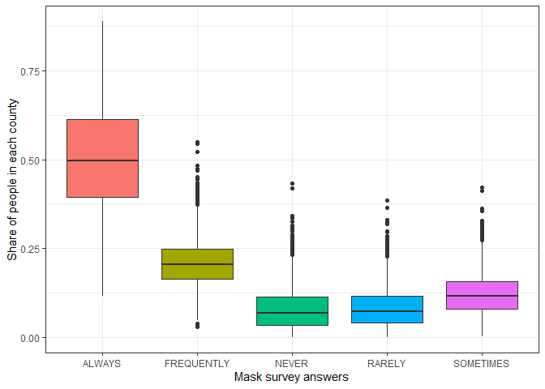<!-- -->

For plotting the **boxplot**, dataframes are created for each answer and
the dataframes are binded using *rbind* feature of R. From the plot, it
can be observed that the median of the share of people, of different
counties, who answered **ALWAYS** are higher followed by **FREQUENTLY**,
**SOMETIMES**, **RARELY** and **NEVER**. Also, outliers are not observed
in the share of people who answered **ALWAYS**.

The **advantages** of using boxplot is it handles the large data easily
and displays the outliers in the data along with a clear summary. The
**disadvantages** of using boxplot is that it hides the multimodality
and other features of distributions. It confuses some audiences and also
difficult to locate sometimes. I find boxplot is suitable for this type
of dataset as it is easy to compare the features from the plot.

Next, the empirical cumulative distribution function (**eCDF**) plot is
plotted using *stat\_ecdf* feature for a share of people answered
**ALWAYS** or **FREQUENTLY** as shown below.

``` r
library(ggplot2)

mask_data$combined=mask_data$FREQUENTLY+mask_data$ALWAYS

p<-ggplot(mask_data, aes(combined)) + stat_ecdf(geom = "step")

p<-p+labs(x = "Frequently/Always",y = "CDF",face =c("plain"))

p<-p+theme_bw()

p
```

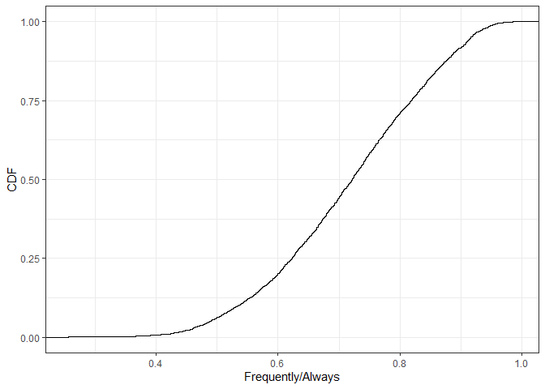<!-- -->

The above plot shows that the cumulative distribution line is increasing
and share of people who answered either **FREQUENTLY/ALWAYAS** are
mostly between 0.4 and 1.0 for different counties. However, it is hard
to predict or compare the features in the dataset. The ECDF is an
estimator that allows us to plot features of our data in order from
least to greatest. I observe that ECDF is not the best plot for the NYT
MASK DATA as it is hard to analyze from the plot.

Below are the histograms generated for the share of people answered
**ALWAYS** or **FREQUENTLY** with two different bin sizes using the
*geom\_histogram()* feature of R. Further, the default labels are
replaced by custom labels using the *labs* feature, and the background
of the plot is changed using *theme\_bw()* feature.

``` r
library(ggplot2)

p<-ggplot(mask_data, aes(x=combined))+geom_histogram(binwidth=0.01,color="black", fill="blue")

p<-p+labs(x = "Frequently/Always",y = "count",face =c("plain"))
p<-p+theme_bw()
p
```

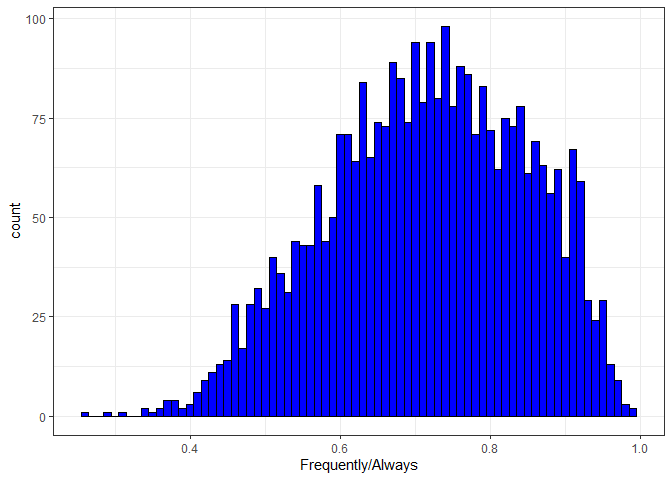<!-- -->

``` r
p<-ggplot(mask_data, aes(x=combined))+geom_histogram(binwidth=0.03,color="black", fill="blue")

p<-p+labs(x = "Frequently/Always",y = "count",face =c("plain"))
p<-p+theme_bw()
p
```

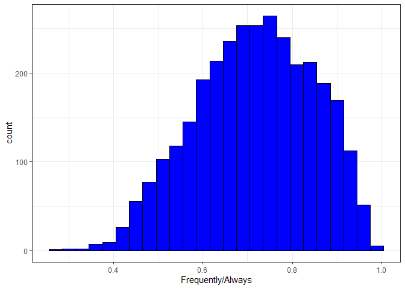<!-- -->

From the plot, it can be observed that the mode of share of people, for
all the counties, who have answered **FREQUENTLY** or **RARELY** is
around 80%. Further, the histogram is skewed normal distribution towards
left, with mean shifted to the left. The histogram with higher width
tends towards a smother distribution and however much higher width does
not give clear information about the distribution.

The **advantages** of the histogram is simplicity and versatility to
work with large ranges of information in the data. It is used in many
situations to offer an insightful look at frequency distribution. The
**disadvantages** of the histogram are the observations that could be
misleading sometimes because of too many blocks.

From the three plots, I feel that *boxplot* is better for the NYT MASK
DATA than *eCDF* and *histogram*.

## Part 2: [US Census Bureau County Population dataset](https://www.census.gov/data/datasets/time-series/demo/popest/2010s-counties-total.html#par_textimage_70769902):

In part2, the US Census dataset is analyzed. The data has several
columns in which the **CENSUS2010POPULATION** column has been selected
and plotted using *boxplot*. First, the plot is generated using the
original scale as shown below.

``` r
library(ggplot2)
library(tidyverse)
library(scales)
```

    ## 
    ## Attaching package: 'scales'

    ## The following object is masked from 'package:purrr':
    ## 
    ##     discard

    ## The following object is masked from 'package:readr':
    ## 
    ##     col_factor

``` r
census_bureau <- read.csv(file='co-est2019-alldata.csv')


CENSUS2010POP = data.frame(answers = "CENSUS2010POP", value = census_bureau$CENSUS2010POP)

plot.data = rbind(CENSUS2010POP)

p<-ggplot(plot.data, aes(x=answers, y=value, fill=answers)) +  geom_boxplot()

p<-p+labs(x = "",y = "Population",face =c("plain"))
p<-p+theme_bw()+ theme(legend.position = "none")
p
```

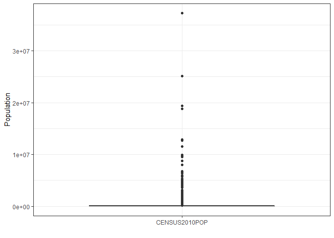<!-- -->

The *boxplot* shows a lot of outliers and difficult to observed the
statistics from the plot. To overcome this problem, a log scale is used
to plot the data as shown below. For this purpose, *scales* package is
used and *log10\_trains()* feature is used in the
*scale\_y\_continuous()* function.

``` r
library(ggplot2)
library(tidyverse)
library(scales)

census_bureau <- read.csv(file='co-est2019-alldata.csv')


CENSUS2010POP = data.frame(answers = "CENSUS2010POP", value = census_bureau$CENSUS2010POP)

plot.data = rbind(CENSUS2010POP)

p<-ggplot(plot.data, aes(x=answers, y=value, fill=answers)) +  geom_boxplot()

p<-p+labs(x = "",y = "Population",face =c("plain"))
p<-p+theme_bw()+ theme(legend.position = "none")

p <- p + scale_y_continuous(trans = log10_trans(),
    breaks = trans_breaks("log10", function(x) 10^x),
    labels = trans_format("log10", math_format(10^.x))) 

p
```

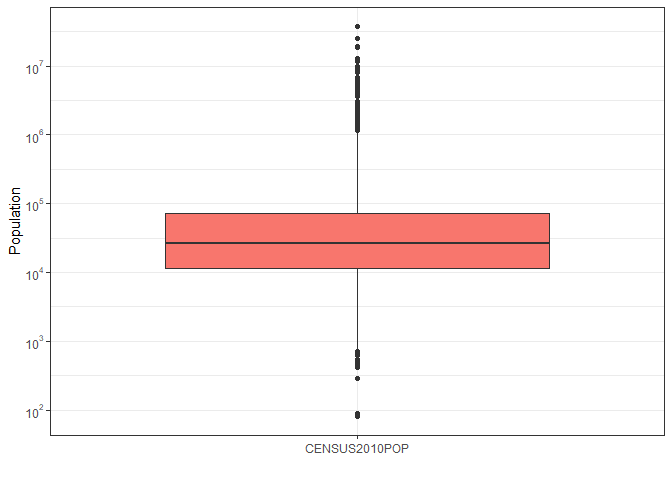<!-- -->

The *boxplot* on log scale shows very good information with median and
Q1, Q2 quantiles for the states pouplations is around 4x \[10^4\],
\[10^4\] and 9x \[10^4\] respectively. To improve the visualization of
boxplot further, 25%, 50%, 75%, 90%, 95%, and 99% quantiles is extracted
from the data as shown below.

``` r
prcntl_values <- quantile(CENSUS2010POP$value, c(.25, .50, .75, .90, .95, .97, .99))
prcntl_values
```

    ##       25%       50%       75%       90%       95%       97%       99% 
    ##   11299.0   26424.0   71404.0  238281.6  560837.8  916610.9 3588277.3

The data points under 99% quantiles are with a population below 3588277.
The data points with a population above this value are removed and box
plots are generated using normal and log scales as shown below.

``` r
CS2010_99 <- CENSUS2010POP[with(CENSUS2010POP, value > prcntl_values[7]),]
plot.data = rbind(CS2010_99)
p<-ggplot(plot.data, aes(x=answers, y=value, fill=answers)) +  geom_boxplot()
p<-p+labs(x = "",y = "Population",face =c("plain"))
p<-p+theme_bw()+ theme(legend.position = "none")
p
```

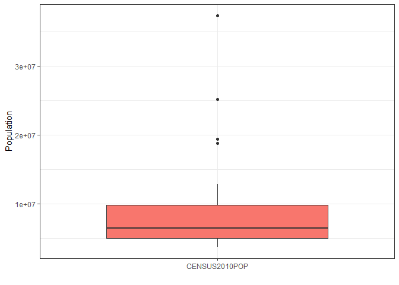<!-- -->

``` r
p <- p + scale_y_continuous(trans = log10_trans(),
    breaks = trans_breaks("log10", function(x) 10^x),
    labels = trans_format("log10", math_format(10^.x))) 
p
```

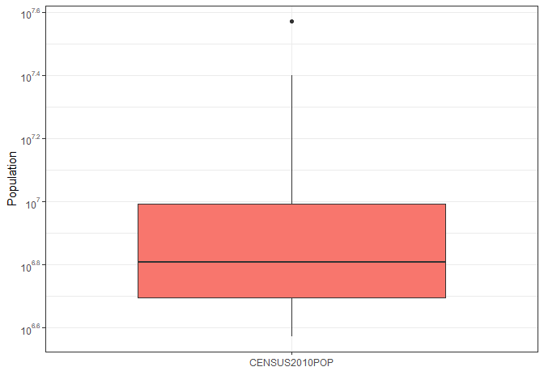<!-- -->

The *boxplots* shows good information with both normal and log scales
but some of the data is removed in the above plots. The *boxplot* with
log scale, including the data points above 99 percentile, also shows
good information. Hence, the entire data is used for *eCDF*, *histogram*
plots, and normal scale and log scales plots are compared.

``` r
library(ggplot2)
library(scales)

p<-ggplot(CENSUS2010POP, aes(value)) + stat_ecdf(geom = "step")

p<-p+labs(x = "CENSUS2010POP",y = "CDF",face =c("plain"))
p<-p+theme_bw()
p
```

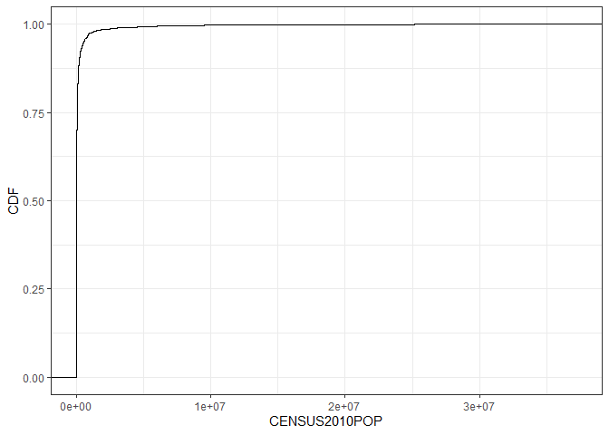<!-- -->

``` r
p <- p + scale_x_continuous(trans = log10_trans(),
    breaks = trans_breaks("log10", function(x) 10^x),
    labels = trans_format("log10", math_format(10^.x))) 

p
```

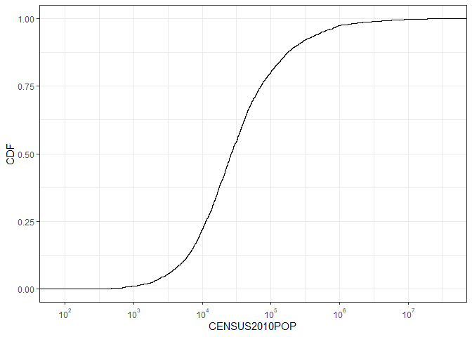<!-- -->

The *eCDF* plot on the normal scale does not give clear information
about the distribution and whereas, the plot on the log scale shows good
information. From *eCDF*, it can be observed that most of the people are
between \[10^3\] and \[10^7\] and it does not show information about the
outlines.

Next, histograms are plotted for **CENSUS2010POP** data of all the
counties with two different bin widths only in log scales as the plots
in the normal scale are not showing good information.

``` r
p<-ggplot(CENSUS2010POP, aes(x=value))+geom_histogram(binwidth=0.1,color="black", fill="blue")
p<-p+labs(x = "Frequently/Always (log10 scale)",y = "count",face =c("plain"))
p<-p+theme_bw()

p <- p + scale_x_continuous(trans = log10_trans(),
    breaks = trans_breaks("log10", function(x) 10^x),
    labels = trans_format("log10", math_format(10^.x))) 

p
```

<!-- -->

``` r
p<-ggplot(CENSUS2010POP, aes(x=value))+geom_histogram(binwidth=0.2,color="black", fill="blue")
p<-p+labs(x = "Frequently/Always (log10 scale)",y = "count",face =c("plain"))
p<-p+theme_bw()

p <- p + scale_x_continuous(trans = log10_trans(),
    breaks = trans_breaks("log10", function(x) 10^x),
    labels = trans_format("log10", math_format(10^.x))) 

p
```

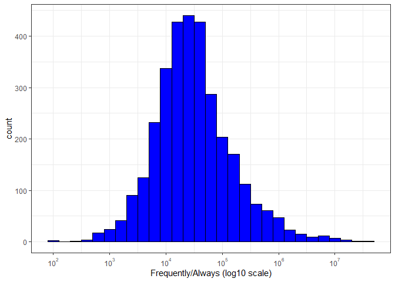<!-- --> From the
histogram, it is observed that the distribution is close to a left
tailed normal with the mode around 3e4.

3.  [US Census Bureau State Population
    dataset](https://www.census.gov/data/tables/time-series/demo/popest/2010s-state-total.html#par_textimage)

In this section, the population data of each state is visualized. The
data set contains the population of each county of all states and the
visualization need to be conducted for each state. For this purpose, the
population of all counties in each state is combined.

First, a dataframe ( **est2019req** ) is created for state name(
**STNAME** ) ,birth rates ( **BIRTHS2019** ), death rates(
**DEATHS2019** ) and migration rates( **RINTERNATIONALMIG2019** ). From
this dataframe ( **est2019req** ), the population with same states are
aggregated using **aggregate()** function of R as shown below.

``` r
library(ggplot2)
library(tidyverse)


est2019 <- read.csv(file='co-est2019-alldata.csv')

est2019req <- data.frame(STNAME=est2019$STNAME,
                         BIRTHS2019=est2019$BIRTHS2019,
                         DEATHS2019=est2019$DEATHS2019,
                         RINTERNATIONALMIG2019=est2019$RINTERNATIONALMIG2019)

est2019req=aggregate(. ~ STNAME, data=est2019req, FUN=sum)
```

Next, the boxplot is generated for all the columns in the **est2019req**
dataframe.

``` r
BIRTHS2019 = data.frame(answers = "BIRTHS2019", value = est2019$BIRTHS2019)
DEATHS2019 = data.frame(answers="DEATHS2019", value = est2019$DEATHS2019)
RINTERNATIONALMIG2019 = data.frame(answers="RINTERNATIONALMIG2019", value = est2019$RINTERNATIONALMIG2019)


plot.data = rbind(BIRTHS2019, DEATHS2019, RINTERNATIONALMIG2019)

p1<- ggplot(plot.data, aes(x=answers, y=value,fill=answers))+ geom_boxplot()
p1<-p1+labs(x = "Birth,death and migration rates",y = "Share of people in each state",face =c("plain"))
p1<-p1+theme_bw()+theme(legend.position = "none")
p1 <- p1 + scale_y_continuous(trans = log10_trans(),
    breaks = trans_breaks("log10", function(x) 10^x),
    labels = trans_format("log10", math_format(10^.x)))

p1
```

    ## Warning in self$trans$transform(x): NaNs produced

    ## Warning: Transformation introduced infinite values in continuous y-axis

    ## Warning: Removed 1085 rows containing non-finite values (stat_boxplot).

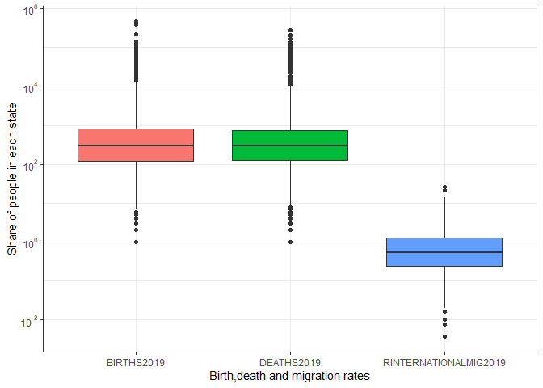<!-- -->

The **boxplot** shows a lot of outliers for all the distributions. From
the plot is observed that the median birth rates and death rates are
almost the same and the median migration rates are lower than the other
two.

Below are the **eCDF** and histogram plots for birth rates (
**BIRTHS2019** ).

``` r
library(ggplot2)

p2<-ggplot(est2019req, aes(BIRTHS2019)) + stat_ecdf(geom = "step")

p2<-p2+labs(x = "est2019 ",y = "BIRTHS2019",face =c("plain"), inherit.aes = FALSE)

p2<-p2+theme_bw()
p2 <- p2 + scale_x_continuous(trans = log10_trans(),
    breaks = trans_breaks("log10", function(x) 10^x),
    labels = trans_format("log10", math_format(10^.x)))

p2
```

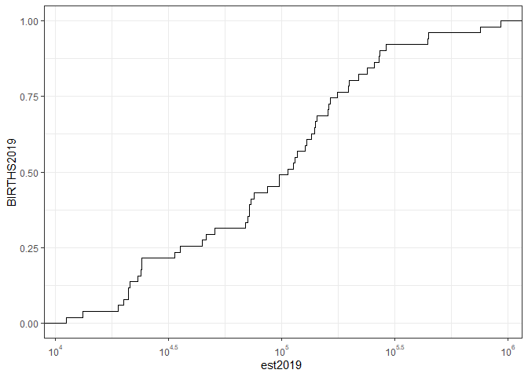<!-- -->

The variation of cumulative distribution function in the **eCDF** plot
is very rough. This is because there are only 50 data points as there
are only 50 states in the united states. From the plot, it is observed
that the population of the states are between \[10^4\] and \[10^6\].

``` r
p<-ggplot(est2019req, aes(x=BIRTHS2019))+geom_histogram(binwidth=0.1,color="black", fill="blue")
p<-p+labs(x = "Frequently/Always (log10 scale)",y = "count",face =c("plain"))
p<-p+theme_bw()

p <- p + scale_x_continuous(trans = log10_trans(),
    breaks = trans_breaks("log10", function(x) 10^x),
    labels = trans_format("log10", math_format(10^.x))) 

p
```

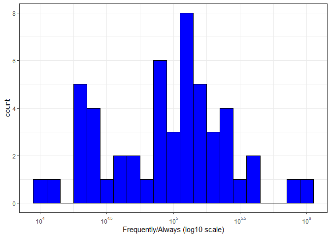<!-- -->

``` r
p<-ggplot(est2019req, aes(x=BIRTHS2019))+geom_histogram(binwidth=0.2,color="black", fill="blue")
p<-p+labs(x = "Frequently/Always (log10 scale)",y = "count",face =c("plain"))
p<-p+theme_bw()

p <- p + scale_x_continuous(trans = log10_trans(),
    breaks = trans_breaks("log10", function(x) 10^x),
    labels = trans_format("log10", math_format(10^.x))) 

p
```

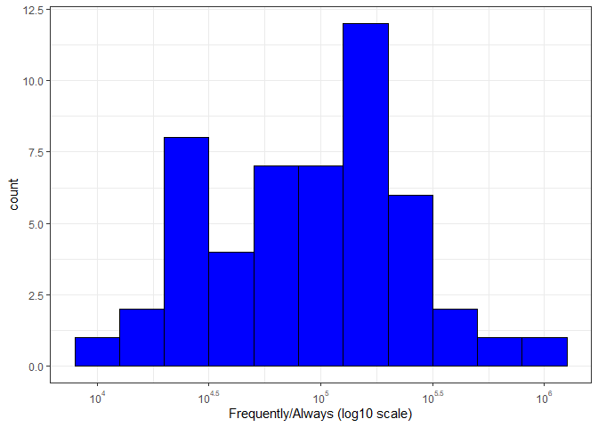<!-- -->

The histograms for the birth rates for all states do not give good
information because there are only a few data points. For the state
population dataset, **boxplot** shows good information compared to
histogram and **eCDF**

## References:

  - Creating dataframe in R:
    <https://stackoverflow.com/questions/11346880/r-plot-multiple-box-plots-using-columns-from-data-frame>

  - Creating boxplot using ggplot:
    <http://www.sthda.com/english/wiki/ggplot2-box-plot-quick-start-guide-r-software-and-data-visualization>

  - Creating ecdf using ggplot:
    <http://www.sthda.com/english/wiki/ggplot2-ecdf-plot-quick-start-guide-for-empirical-cumulative-density-function-r-software-and-data-visualization>

  - Creating histogram using ggplot:
    <http://www.sthda.com/english/wiki/ggplot2-histogram-plot-quick-start-guide-r-software-and-data-visualization>

  - Calculating percentile statistics in R:
    <https://www.r-tutor.com/elementary-statistics/numerical-measures/percentile>
