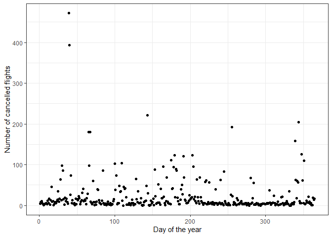
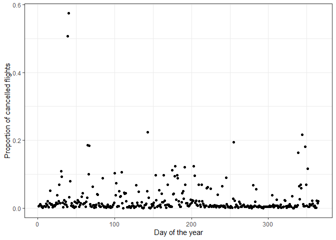
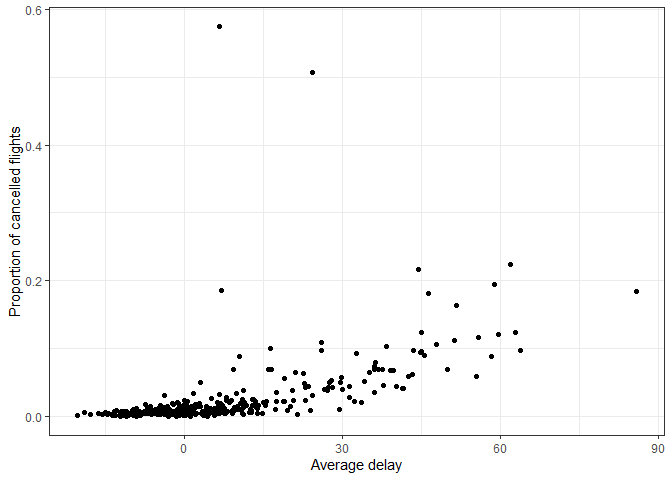
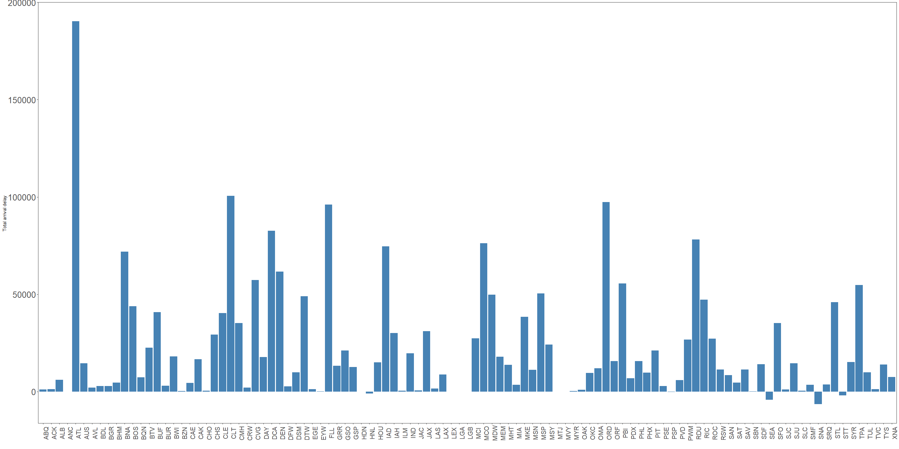
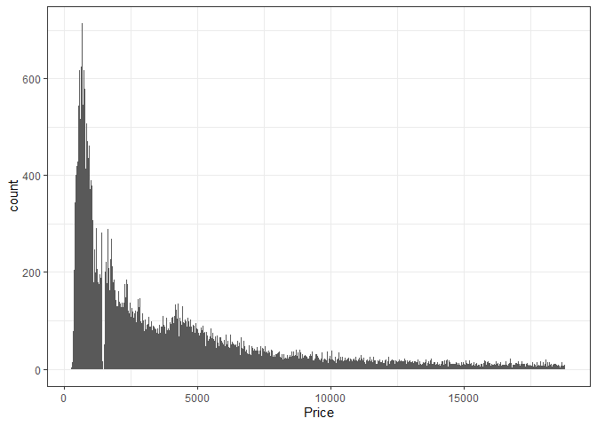
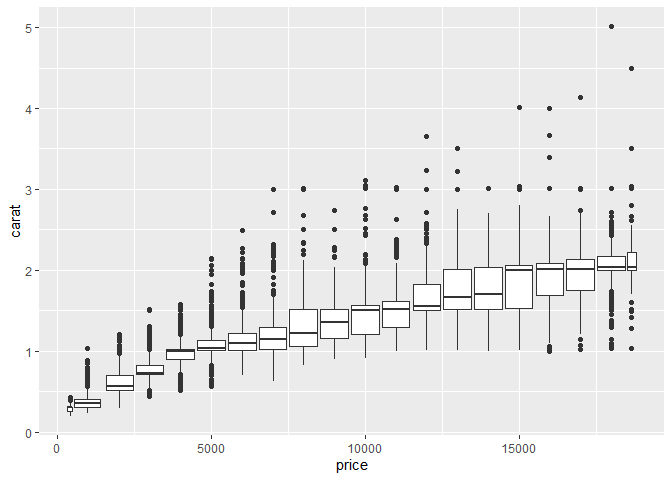
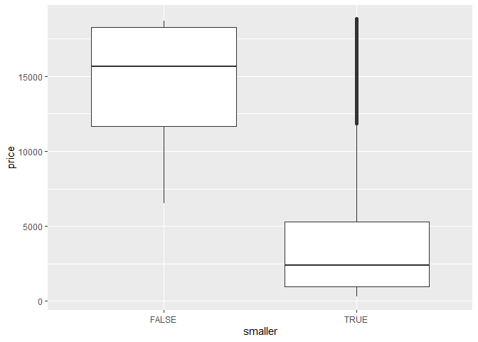
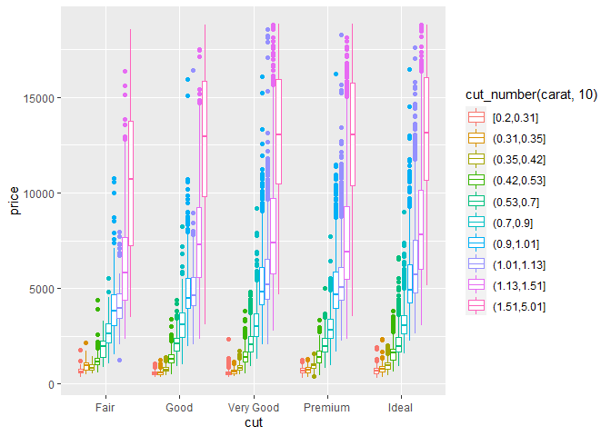
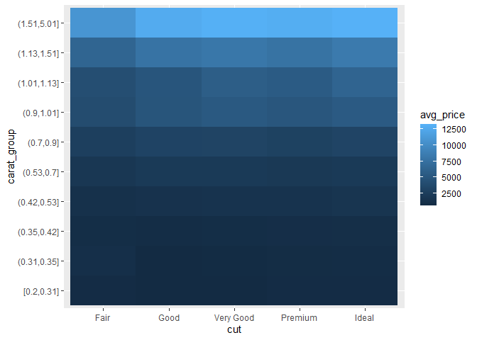

Homework 6
================
Triveni Sangama Saraswathi Edla

[Section 5.6.7](https://r4ds.had.co.nz/transform.html#exercises-12)

### Q1. 4. Look at the number of cancelled flights per day. Is there a pattern? Is the proportion of cancelled flights related to the average delay?

To find the pattern of canceled flights, `summarise()` function is used
to create a data frame with the columns: total number of flights, number
of canceled flights, and average delay on each day of the year. The
number of canceled flights is defined by the number of flights for which
both departure and arrival delay value is `NAN` and is defined in R by
`(is.na(dep_delay) | is.na(arr_delay) )`.

``` r
library(nycflights13)
library(tidyverse)
```

    ## -- Attaching packages --------------------------------------- tidyverse 1.3.0 --

    ## v ggplot2 3.3.2     v purrr   0.3.4
    ## v tibble  3.0.4     v dplyr   1.0.2
    ## v tidyr   1.1.2     v stringr 1.4.0
    ## v readr   1.4.0     v forcats 0.5.0

    ## -- Conflicts ------------------------------------------ tidyverse_conflicts() --
    ## x dplyr::filter() masks stats::filter()
    ## x dplyr::lag()    masks stats::lag()

``` r
flibyday <- group_by(flights, year, month, day)
flibyday <- flibyday %>% summarise(count = n(), 
                                   cancelled_flights=sum(is.na(dep_delay) & is.na(arr_delay)),
                                   delay = mean(arr_delay, na.rm = TRUE))
```

    ## `summarise()` regrouping output by 'year', 'month' (override with `.groups` argument)

``` r
p<-ggplot(data = flibyday, mapping = aes(x = 1:nrow(flibyday), y = cancelled_flights))+geom_point()
p<-p+labs(x = "Day of the year",y = "Number of cancelled flights",face =c("plain"))
p<-p+theme_bw()
p
```

<!-- -->

``` r
p<-ggplot(data = flibyday, mapping = aes(x = 1:nrow(flibyday), y = cancelled_flights/count))+geom_point()
p<-p+labs(x = "Day of the year",y = "Proportion of cancelled flights",face =c("plain"))
p<-p+theme_bw()
p
```

<!-- -->

The above plots visualize the variation of the number of canceled
flights and the proportion of canceled flights over 365 days of the year
2013 using `geom_point()` and `ggplot()` functions. The above plots do
not show any pattern and to further analyze the data, a scatter plot
between the proportion of canceled flights, and the average arrival
delay is plotted using the below code.

``` r
library(tidyverse)
p<-ggplot(data = flibyday, mapping = aes(y = cancelled_flights/count, x = delay))+geom_point()
p<-p+labs(y = "Proportion of cancelled flights",x = "Average delay",face =c("plain"))
p<-p+theme_bw()
p
```

<!-- -->

The above scatter plot shows a positive correlation between the
proportion of canceled flights and the average arrival delay. The higher
the average arrival delay on a day, the higher the proportion of
canceled flights.

[Section 5.7.1](https://r4ds.had.co.nz/transform.html#exercises-13)

### Q2. 2. Which plane (tailnum) has the worst on-time record?

To find the plane with the worst on-time record, not-canceled flights
are filtered using `filter()` function. From the not-canceled flights, a
data frame is created by grouping the flights by `tailnum` using
`group_by()` function, and average arrival delay ( `arr_delay` ) is
calculated using `summarise()` function. From the data frame, flights
with top 10 worst on-time record is filtered by combination of
`filter()`, `rank()`, `desc()` functions using
`filter(rank(desc(mean_delay)) < 10)`. All the above operations are
performed in a single code line by using `%>%` and stored into the data
frame with name `delays`. The planes are arranged in decreasing order of
average delay using `arrange()` function as `arrange(delays,
desc(mean_delay))`. Below is the code for extracting the top 10 worst
on-time record planes.

``` r
not_cancelled <- flights %>% 
  filter(!is.na(dep_delay), !is.na(arr_delay))
delays <- not_cancelled %>% 
  group_by(tailnum) %>% 
  summarise(mean_delay = mean(arr_delay)) %>% 
  filter(rank(desc(mean_delay)) < 10)
```

    ## `summarise()` ungrouping output (override with `.groups` argument)

``` r
delays <- arrange(delays, desc(mean_delay))
delays
```

    ## # A tibble: 9 x 2
    ##   tailnum mean_delay
    ##   <chr>        <dbl>
    ## 1 N844MH        320 
    ## 2 N911DA        294 
    ## 3 N922EV        276 
    ## 4 N587NW        264 
    ## 5 N851NW        219 
    ## 6 N928DN        201 
    ## 7 N7715E        188 
    ## 8 N654UA        185 
    ## 9 N665MQ        175.

The above plots show that plane with `tailnum`: `N844MH` has the worst
on-time record with a mean arrival delay of 320 minutes.

### Q3. 4. For each destination, compute the total minutes of delay. Don’t need to answer the 2nd part of the question in the book.

The total minutes of delay of all the flights landing in each
destination is obtained using `summarise()`, `group_by()`, `sum()`
functions. Then the destinations with highest total minutes of delay is
printed by filtering and arranging in decreasing order using
`filter(rank(desc(total_delay)) < 10) %>% arrange(desc(total_delay))`.
Below is the code for this purpose.

``` r
popular_dests <- flights %>% group_by(dest) %>% summarise(total_delay = sum(arr_delay,na.rm = TRUE)) 
```

    ## `summarise()` ungrouping output (override with `.groups` argument)

``` r
popular_dests %>%  filter(rank(desc(total_delay)) < 10) %>% arrange(desc(total_delay))
```

    ## # A tibble: 9 x 2
    ##   dest  total_delay
    ##   <chr>       <dbl>
    ## 1 ATL        190260
    ## 2 CLT        100645
    ## 3 ORD         97352
    ## 4 FLL         96153
    ## 5 DCA         82609
    ## 6 RDU         78107
    ## 7 MCO         76185
    ## 8 IAD         74631
    ## 9 BNA         71867

The above output shows that Atlanta (ATL) has the highest total arrival
delay with 190260 minutes and the below code generates the barplot of
total delay for all destinations.

``` r
p<-ggplot(data=popular_dests, aes(x=dest, y=total_delay)) +
  geom_bar(stat="identity",fill="steelblue")
p<-p+theme_bw()
p<-p+ theme(axis.text.x = element_text(angle=90,size=15),
            axis.text.y = element_text(size=20),
            panel.grid.major.x = element_blank(),
            panel.grid.minor.x = element_blank(),
            panel.grid.major.y = element_blank(),
            panel.grid.minor.y = element_blank(),
            plot.title = element_text(face = "plain",size=20))
p<-p+xlab("")
p<-p+ylab("Total arrival delay ")
p
```

<!-- -->

[Section 7.3.4](https://r4ds.had.co.nz/exploratory-data-analysis.html#exercises-15)

### Q4. 2. Explore the distribution of price. Do you discover anything unusual or surprising? (Hint: Carefully think about the binwidth and make sure you try a wide range of values.)

Below code plots the distribution of price of diamonds using `ggplot()`
and `geom_histogram()` functions. A histogram is used to visualize the
distribution.

``` r
p <- ggplot(data = diamonds) +
  geom_histogram(mapping = aes(x = price), binwidth = 20)
p<-p+labs(x = "Price")
p<-p+theme_bw()
p
```

<!-- -->

The above plot shows that the distribution of price is right-skewed with
a peak around 1000. By using bandwidth as 20, it can be observed that
the histogram has many spikes. From the graph, we can say that most of
the diamonds are under 1,000 and surprisingly there are no diamonds in
the price range of around 1500. The number of diamonds decreases as the
price increases.

### Q5. 3. How many diamonds are 0.99 carat? How many are 1 carat? What do you think is the cause of the difference?

To find the diamonds with `carat` values of 0.99 and 1.0, `count()` and
`filter()` functions are used as shown in the below code.

``` r
caratcount <- diamonds %>% count(carat) %>%  filter(carat==1|carat==0.99) 
caratcount
```

    ## # A tibble: 2 x 2
    ##   carat     n
    ##   <dbl> <int>
    ## 1  0.99    23
    ## 2  1     1558

By comparing the count of diamonds based on `carat` value, it is
observed that there is a lot of difference between the number of
diamonds with `carat` value of 0.99 and `carat` value of 1. The reason
may be the diamonds with `carat` value of 0.99 is rounded to a \``carat`
value of 1.

[Section 7.5.1.1](https://r4ds.had.co.nz/exploratory-data-analysis.html#exercises-17)

### Q6. 1. Use what you’ve learned to improve the visualisation of the departure times of cancelled vs. non-cancelled flights from the end of Section 7.4.

Below is the original visualization, where the canceled and non-canceled
flights are compared by plotting the number of flights against departure
time (`dep_time`) using `geom_freqpoly()` function.

``` r
nycflights13::flights %>% 
  mutate(
    cancelled = is.na(dep_time),
    sched_hour = sched_dep_time %/% 100,
    sched_min = sched_dep_time %% 100,
    sched_dep_time = sched_hour + sched_min / 60
  ) %>% 
  ggplot(mapping = aes(sched_dep_time)) + 
    geom_freqpoly(mapping = aes(colour = cancelled), binwidth = 1/4)
```

<!-- -->

The problem with the original visualization is that there are far less
canceled flights compared to non-canceled flights. This is the reason
the distribution of non-canceled flights looks flat when plotted
simultaneously with non-canceled flights. To improve the comparison, the
density is plotted on the y-axis using `y=..density..` as shown in the
below code.

``` r
p<-nycflights13::flights %>% 
  mutate(
    cancelled = is.na(dep_time),
    sched_hour = sched_dep_time %/% 100,
    sched_min = sched_dep_time %% 100,
    sched_dep_time = sched_hour + sched_min / 60
  ) %>% 
  ggplot(mapping = aes(x=sched_dep_time,y=..density..)) + 
    geom_freqpoly(mapping = aes(colour = cancelled), binwidth = 1/4)
p
```

<!-- -->

The above visualization shows a good comparison of the distribution of
canceled flight and non-canceled flight. The plot shows that more
flights are canceled with an increase in scheduled departure time.
Another alternative way to the compare the distribution in a compact way
is by using boxplots. Below is the code to compare the distribution of
canceled flight and non-canceled flight using boxplots.

``` r
p<-nycflights13::flights %>% 
  mutate(
    cancelled = is.na(dep_time),
    sched_hour = sched_dep_time %/% 100,
    sched_min = sched_dep_time %% 100,
    sched_dep_time = sched_hour + sched_min / 60
  ) %>% 
  ggplot(mapping = aes(y=sched_dep_time,x=cancelled)) + geom_boxplot()
p
```

<!-- -->

The above boxplot shows that the median departure time of canceled
flights is more than the non-cancelled flights.

### Q7. 2. What variable in the diamonds dataset is most important for predicting the price of a diamond? How is that variable correlated with cut? Why does the combination of those two relationships lead to lower quality diamonds being more expensive?

The below code plots the scatter plot between `price` and `carat`.

``` r
p<-ggplot(data = diamonds, mapping = aes(x = carat, y = price))+geom_point()
p<-p+labs(x = "Carat",y = "Price",face =c("plain"))
p<-p+theme_bw()
p
```

<!-- -->

The above plot shows that variable `carat` is the most important for
predicting the price of the diamond and the `price`` is positively
correlated with variable`carat`.`carat`is the most correlated variable
with price, so it is the important variable in predicting`price\`\`\` of
diamonds.

``` r
p<-ggplot(data = diamonds, mapping = aes(x = cut, y = carat)) +
  geom_boxplot()
p
```

<!-- -->

The above boxplot shows that the median value of carat decreases with
better quality (`cut`) of the diamond on an average. The `ideal cut` is
the highest quality and `fair cut` is the lowest quality. The boxplot
shows that lower quality (`cut`) diamonds have higher median carat value
and higher carat value is more expensive as shown in the scatter plot
between `price` and `carat`. This makes the lower quality diamond more
expensive.

### Extra credit (1 point): 3. Install the ggstance package, and create a horizontal boxplot. How does this compare to using coord\_flip()?

Below is the horizontal boxplot visualized using `geom_boxplot()` and
`coord_flip()` functions between variables `cut` and `carat`.

``` r
p<-ggplot(data = diamonds, mapping = aes(x = cut, y = carat)) +
  geom_boxplot()+ coord_flip()
p
```

<!-- -->

Above boxplot is recreated using `ggstance` package with single function
`geom_boxploth()` instead of using `geom_boxplot()` and `coord_flip()`
functions.

``` r
library(ggstance)
```

    ## 
    ## Attaching package: 'ggstance'

    ## The following objects are masked from 'package:ggplot2':
    ## 
    ##     geom_errorbarh, GeomErrorbarh

``` r
p<-ggplot(data = diamonds, mapping = aes(carat, y = cut)) +
  geom_boxploth()
p
```

<!-- -->

It can be observed that both boxplots are similar. However, when using
`geom_boxploth()` from `ggstance`, the values of x and y in mapping need
to be switched.

[Section 7.5.3.1](https://r4ds.had.co.nz/exploratory-data-analysis.html#exercises-19)

### Q8. 2. Visualize the distribution of carat, partitioned by price.

Below code is used to create plot to visualize the distribution of
`carat` partitioned by `price`. In the code `mapping = aes(group =
cut_width(price, 1000))` is used in the `geom_boxplot()` function to
divide `price` into bins of width 1000.

``` r
p <- ggplot(data = diamonds, mapping = aes(x = price, y = carat)) + 
  geom_boxplot(mapping = aes(group = cut_width(price, 1000)))
p
```

<!-- -->

The above plot shows that as the `price` increases, the median value of
`carat` increases.

### Q9. 3. How does the price distribution of very large diamonds compare to small diamonds? Is it as you expect, or does it surprise you?

The diamonds are divided into larger and smaller diamonds based on the
`carat` value using `mutate()` function. The diamonds with `carat<3.0`
is considered as small and others as large diamonds.

``` r
sldiv <- diamonds %>%  mutate(smaller=(carat<3))
p <- ggplot(sldiv,mapping = aes(y=price,x=smaller)) + geom_boxplot()
p
```

<!-- -->

The above boxplot shows that the median price of larger diamonds (FALSE)
is more than the smaller diamonds (TRUE), which is expected. However,
smaller diamonds have a lot of outliers on the higher price side and
some values are even higher than the median price of larger diamonds.

### Q10. 4. Combine two of the techniques you’ve learned to visualize the combined distribution of cut, carat, and price.

The combined distribution of `cut`, `carat`, and `price` can be
visualized using a boxplot and heat map. Below is the code for boxplots.
For the boxplots, the `carat` value is divided into 10 intervals,
representing 10 categories for `carat`. Then 10 boxplots, for each
category of `carat`, are plotted at each `cut` category of diamonds to
visualize the distribution of `price`.

``` r
diamonds %>% ggplot() +
  geom_boxplot(mapping = aes(x = cut, y = price,
                             color = cut_number(carat, 10)))
```

<!-- -->

``` r
diamonds %>% mutate(carat_group = cut_number(carat, 10)) %>%
  group_by(cut, carat_group) %>%
  summarize(avg_price = mean(price)) %>%
  ggplot() +
  geom_tile(mapping = aes(x = cut, y = carat_group,
                          fill = avg_price))
```

    ## `summarise()` regrouping output by 'cut' (override with `.groups` argument)

<!-- -->

## References:

  - Data transformation: <https://r4ds.had.co.nz/transform.html>
  - Exploratory Data Analysis:
    <https://r4ds.had.co.nz/exploratory-data-analysis.html>
  - Installing ggstance package:<https://rdrr.io/cran/ggstance/>
