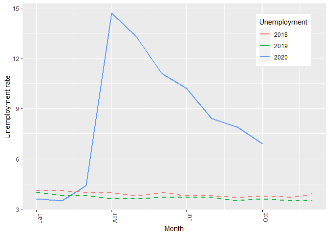
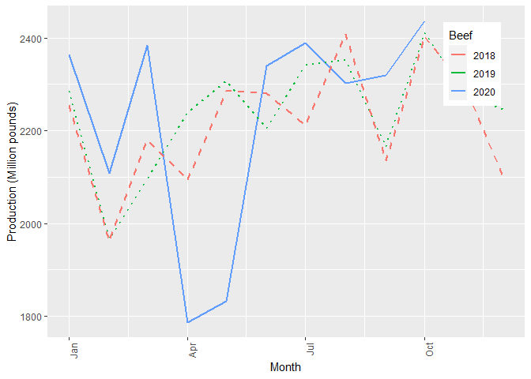

Homework 7
================
Triveni Sangama Saraswathi Edla

CS 625, Fall 2020

In this homework, EDA techniques are used to generate questions by
exploring various datasets, and charts are proposed to answer those
questions. This homework is divided into two sections. In the first
section, the following datasets are explored:

  - Coronavirus (Covid-19) cases
  - The unemployment rate
  - Unit labor costs and labor productivity of different business
    sectors
  - Beef and chicken production and prices
  - Crude oil production and fuel prices
  - Automotive units sales

In the second section, questions are generated based on the EDA, and
charts are proposed to answer the questions. The primary dataset used is
COVID-19 cases and its effect on different datasets is explored. The R
programming language is used for EDA.

The data files that are downloaded from various Data Sources are placed
in `raw_data_files` and `cleaned_data_files` folders. All the data files
are in .xslx and .csv formats. The `raw_data_files` folder contains the
original data files that need to be cleaned before importing into R.
From these original datasets, the required data is copied into the files
that can be imported into R and saved into `cleaned_data_files` folder.
Some of the original data files that can be imported into R are directly
placed into `cleaned_data_files` folder (Throughout the homework, the
name of the data files that are imported into R are mentioned inside the
curved brackets).

## 1\. EDA process to explore different datasets

### 1.1. Coronavirus (Covid-19) Data

First, [COVID-19](https://github.com/nytimes/covid-19-data)
(*us\_coronavirus.csv*) dataset is explored. The dataset consists of
columns *date* , *cases* and *deaths* of COVID cases by each day. The
dataset contains time series of cumulative counts of COVID-19 cases in
the United States and a new column is created with new cases per day
using `diff()` function in R.

The below figure shows the variation of new cases per day. The figure
shows that the COVID cases started in early March and the first peak of
new cases was observed around early May. The new cases slightly
decreased after May and then a surge of daily cases is observed. The
reason is due to casual [dinner parties , game
nights](https://www.washingtonpost.com/health/2020/11/12/covid-social-gatherings/)
and [election
ralies](https://www.news-medical.net/news/20201104/Election-rallies-linked-to-an-increase-in-COVID-19-hospitalizations.aspx).

``` r
library(dplyr)
```

    ## 
    ## Attaching package: 'dplyr'

    ## The following objects are masked from 'package:stats':
    ## 
    ##     filter, lag

    ## The following objects are masked from 'package:base':
    ## 
    ##     intersect, setdiff, setequal, union

``` r
library(tidyr)
library(ggplot2)
library(lubridate)
```

    ## 
    ## Attaching package: 'lubridate'

    ## The following objects are masked from 'package:base':
    ## 
    ##     date, intersect, setdiff, union

``` r
library(scales)

data_coronavirus <- read.csv(file='./cleaned_data_files/us_coronavirus.csv')
data_coronavirus$date <- ymd(data_coronavirus$date)

#creating new column with number of new cases
data_coronavirus <- within(data_coronavirus, new_cases <- c(0,diff(cases)))

library(ggplot2)
p<-ggplot(data=data_coronavirus, aes(x=date, y=new_cases)) +  geom_line()
p<-p+theme(axis.text.x = element_text(angle=90, hjust = 1))
p<-p+scale_x_date(labels = date_format("%b"))
p<-p+labs(x = "Month",y = "Number of new COVID cases, per day")
p
```

<!-- -->

### 1.2. Unemployement Rate

The affect of COVID-19 pandemic on unemployment rate is explored using
the
[dataset](https://beta.bls.gov/dataViewer/view/timeseries/LNS14000000)
(saved as *us\_unemployment.csv*) from [U.S. BUREAU of LABOR
STATISTICS](https://www.bls.gov/data/). The original data file contains
columns with names *Series ID*, *Year*, *Period*, *Label*, and *Value*.
The original data file is directly imported into R and the unemployment
rate for the years 2018, 2019, and 2020 are plotted as shown in the
below figure.

To plot the line graph, modifications are applied to the columns in the
dataset. The column *month* has been converted to a number using the
`match()` function. The columns *year* and *month* are combined using
the `with()` function. The column *date* is converted into date data
type using the function `ymd()`. These functions are also used
frequently throughout this homework.

``` r
library(dplyr)
library(tidyr)
library(ggplot2)
library(lubridate)
library(scales)

data_unemployment<- read.csv(file = './cleaned_data_files/us_unemployment.csv')
data_unemployment <- data_unemployment%>% select(Year, Label, Value)
data_unemployment <- data_unemployment %>% separate(Label, c("y", "Month"))
data_unemployment <- data_unemployment%>% select(Year, Month, Value)

#Converting month to number
data_unemployment$Month=match(data_unemployment$Month,month.abb)
#Combining year and month
data_unemployment$Date <- with(data_unemployment, sprintf("00-%02d-01", data_unemployment$Month))
#Converting to date date datatype
data_unemployment$Date<- ymd(data_unemployment$Date)

data_unemployment <- data_unemployment%>% select(Year,Date, Value)

p<-ggplot()
p<-p+geom_line(data=data_unemployment %>% filter(Year==2020), aes(x=Date, y=Value,color="2020"),lwd = 1)
p<-p+geom_line(data=data_unemployment %>% filter(Year==2019), aes(x=Date, y=Value,color="2019"),lwd = 1,linetype = "dashed")
p<-p+geom_line(data=data_unemployment %>% filter(Year==2018), aes(x=Date, y=Value,color="2018"),lwd = 1,linetype = "dashed")
p<-p+scale_color_discrete(name = "Unemployment")
p<-p+theme(axis.text.x = element_text(angle=90, hjust = 1),legend.position = c(.95, .95),legend.justification = c("right", "top"),plot.title = element_text(face = "plain",hjust = 0.5))
p<-p+scale_x_date(labels = date_format("%b"))
p<-p+labs(x = "Month",y = "Unemployment rate")
p
```

<!-- -->

The above figure shows that the unemployment rates are high, compared to
previous years, due to the COVID-19 pandemic and the peak is observed to
be at the start of April, which is around the first peak of new COVID-19
cases. The unemployment rate is below 4.5 % in 2018 and 2019.

### 1.3. Unit labor costs and labor productivity of different business sectors

To visualize the effect of the COVID-19 pandemic on different business
sectors, the following datasets are explored:

  - Unit labor prices of [Nonfarm
    business](https://beta.bls.gov/dataViewer/view/timeseries/PRS85006112)
    (*us\_unit\_labor\_costs\_nonfarm.csv*),
    [Manufacturing](https://beta.bls.gov/dataViewer/view/timeseries/PRS30006112)
    (*us\_unit\_labor\_costs\_manufacturing.csv*) and
    [Business](https://beta.bls.gov/dataViewer/view/timeseries/PRS84006112)
    (*us\_unit\_labor\_costs\_business.csv*).
  - Labor productivity of [Nonfarm
    business](https://beta.bls.gov/dataViewer/view/timeseries/PRS85006092)
    (*us\_unit\_labor\_productivity\_nonfarm.csv*),
    [Manufacturing](https://beta.bls.gov/dataViewer/view/timeseries/PRS30006092)
    (*us\_unit\_labor\_productivity\_manufacturing.csv*) and
    [Business](https://beta.bls.gov/dataViewer/view/timeseries/PRS84006092)
    (*us\_unit\_labor\_productivity\_business.csv*).

The datasets have the columns: *SeriesID*, *Year*, *Period*, *Label*,
and *Value*. The columns *Year*, *Label*, and *Value* are selected using
`select()` function to develop the above charts. The column *period* has
four quarters defined as Q01(January, February, and March), Q02(April,
May, and June), Q03(July, August, and September), Q04(October, November,
and December).To compare with the other figures, the last month of the
respective quarter is considered as the month, where the data is
available.

#### Nonfarm business

``` r
data_labor_costs_nonfarm<- read.csv(file = './cleaned_data_files/us_unit_labor_costs_nonfarm.csv')
data_labor_costs_nonfarm <- data_labor_costs_nonfarm%>% select(Year, Label, Value)
data_labor_costs_nonfarm <- data_labor_costs_nonfarm %>% separate(Label, c("y", "Month"))
data_labor_costs_nonfarm <- data_labor_costs_nonfarm%>% select(Year, Month, Value)

for (row in 1:nrow(data_labor_costs_nonfarm)) 
  {
    if (data_labor_costs_nonfarm[row, "Month"]=="Qtr1")
    {
      data_labor_costs_nonfarm[row, "Month"]="Mar"
    }
    else if (data_labor_costs_nonfarm[row, "Month"]=="Qtr2")
    {
      data_labor_costs_nonfarm[row, "Month"]="Jun"
    }
    else if (data_labor_costs_nonfarm[row, "Month"]=="Qtr3")
    {
      data_labor_costs_nonfarm[row, "Month"]="Sep"
    }
    else if (data_labor_costs_nonfarm[row, "Month"]=="Qtr4")
    {
      data_labor_costs_nonfarm[row, "Month"]="Dec"
    }
}

#Converting month to number
data_labor_costs_nonfarm$Month=match(data_labor_costs_nonfarm$Month,month.abb)
#Combining year and month
data_labor_costs_nonfarm$Date <- with(data_labor_costs_nonfarm, sprintf("00-%02d-01", data_labor_costs_nonfarm$Month))
#Converting to date datatype
data_labor_costs_nonfarm$Date<- ymd(data_labor_costs_nonfarm$Date)
data_labor_costs_nonfarm <- data_labor_costs_nonfarm%>% select(Year,Date, Value)

p<-ggplot()
p<-p+geom_line(data=data_labor_costs_nonfarm %>% filter(Year==2020), aes(x=Date, y=Value,color="2020"),lwd = 1)
p<-p+geom_line(data=data_labor_costs_nonfarm %>% filter(Year==2019), aes(x=Date, y=Value,color="2019"),lwd = 1,linetype = "dashed")
p<-p+geom_line(data=data_labor_costs_nonfarm %>% filter(Year==2018), aes(x=Date, y=Value,color="2018"),lwd = 1,linetype = "dashed")
p<-p+scale_color_discrete(name = "Nonfarm Business")
p<-p+theme(axis.text.x = element_text(angle=90, hjust = 1),legend.position = c(.95, .95),legend.justification = c("right", "top"),plot.title = element_text(face = "plain",hjust = 0.5))
p<-p+scale_x_date(labels = date_format("%b"))
p<-p+labs(x = "Month",y = "Unit labor costs")
p
```

<!-- -->

The above plot shows the variation of unit labor costs of nonfarm
business and it is observed that costs have decreased compared to the
previous year. This may be because many people are fired due to the
COVID-19 pandemic and fewer people are used to share a similar amount of
workload as before the pandemic. This is supported by the below figure
which shows that labor productivity has increased and further supported
by the increased unemployment rate, as discussed in the above
subsections.

``` r
data_prdctvty_nonfarm<- read.csv(file = './cleaned_data_files/us_labor_productivity_nonfarm.csv')
data_prdctvty_nonfarm <- data_prdctvty_nonfarm%>% select(Year, Label, Value)
data_prdctvty_nonfarm <- data_prdctvty_nonfarm %>% separate(Label, c("y", "Month"))
data_prdctvty_nonfarm <- data_prdctvty_nonfarm%>% select(Year, Month, Value)

for (row in 1:nrow(data_prdctvty_nonfarm)) 
  {
    if (data_prdctvty_nonfarm[row, "Month"]=="Qtr1")
    {
      data_prdctvty_nonfarm[row, "Month"]="Mar"
    }
    else if (data_prdctvty_nonfarm[row, "Month"]=="Qtr2")
    {
      data_prdctvty_nonfarm[row, "Month"]="Jun"
    }
    else if (data_prdctvty_nonfarm[row, "Month"]=="Qtr3")
    {
      data_prdctvty_nonfarm[row, "Month"]="Sep"
    }
    else if (data_prdctvty_nonfarm[row, "Month"]=="Qtr4")
    {
      data_prdctvty_nonfarm[row, "Month"]="Dec"
    }
}

#Converting month to number
data_prdctvty_nonfarm$Month=match(data_prdctvty_nonfarm$Month,month.abb)
#Combining year and month
data_prdctvty_nonfarm$Date <- with(data_prdctvty_nonfarm, sprintf("00-%02d-01", data_prdctvty_nonfarm$Month))
#Converting to date datatype
data_prdctvty_nonfarm$Date<- ymd(data_prdctvty_nonfarm$Date)
data_prdctvty_nonfarm <- data_prdctvty_nonfarm%>% select(Year,Date, Value)

p<-ggplot()
p<-p+geom_line(data=data_prdctvty_nonfarm %>% filter(Year==2020), aes(x=Date, y=Value,color="2020"),lwd = 1)
p<-p+geom_line(data=data_prdctvty_nonfarm %>% filter(Year==2019), aes(x=Date, y=Value,color="2019"),lwd = 1,linetype = "dashed")
p<-p+geom_line(data=data_prdctvty_nonfarm %>% filter(Year==2018), aes(x=Date, y=Value,color="2018"),lwd = 1,linetype = "dashed")
p<-p+scale_color_discrete(name = "Nonfarm Business")
p<-p+theme(axis.text.x = element_text(angle=90, hjust = 1),legend.position = c(.95, .95),legend.justification = c("right", "top"),plot.title = element_text(face = "plain",hjust = 0.5))
p<-p+scale_x_date(labels = date_format("%b"))
p<-p+labs(x = "Month",y = "Labor productivity (output per hour)")
p
```

<!-- -->

#### Manufacturing

The trend of unit labor costs of the manufacturing business is reverse
to that of nonfarm business. The unit labor costs have increased for
manufacturing and productivity has decreased after the pandemic.

``` r
data_labor_costs_manufacturing<- read.csv(file = './cleaned_data_files/us_unit_labor_costs_manufacturing.csv')
data_labor_costs_manufacturing <- data_labor_costs_manufacturing%>% select(Year, Label, Value)
data_labor_costs_manufacturing <- data_labor_costs_manufacturing %>% separate(Label, c("y", "Month"))
data_labor_costs_manufacturing <- data_labor_costs_manufacturing%>% select(Year, Month, Value)

for (row in 1:nrow(data_labor_costs_manufacturing)) 
  {
    if (data_labor_costs_manufacturing[row, "Month"]=="Qtr1")
    {
      data_labor_costs_manufacturing[row, "Month"]="Mar"
    }
    else if (data_labor_costs_manufacturing[row, "Month"]=="Qtr2")
    {
      data_labor_costs_manufacturing[row, "Month"]="Jun"
    }
    else if (data_labor_costs_manufacturing[row, "Month"]=="Qtr3")
    {
      data_labor_costs_manufacturing[row, "Month"]="Sep"
    }
    else if (data_labor_costs_manufacturing[row, "Month"]=="Qtr4")
    {
      data_labor_costs_manufacturing[row, "Month"]="Dec"
    }
}

#Converting month to number
data_labor_costs_manufacturing$Month=match(data_labor_costs_manufacturing$Month,month.abb)
#Combining year and month
data_labor_costs_manufacturing$Date <- with(data_labor_costs_manufacturing, sprintf("00-%02d-01", data_labor_costs_manufacturing$Month))
#Converting to date datatype
data_labor_costs_manufacturing$Date<- ymd(data_labor_costs_manufacturing$Date)
data_labor_costs_manufacturing <- data_labor_costs_manufacturing%>% select(Year,Date, Value)

p<-ggplot()
p<-p+geom_line(data=data_labor_costs_manufacturing %>% filter(Year==2020), aes(x=Date, y=Value,color="2020"),lwd = 1)
p<-p+geom_line(data=data_labor_costs_manufacturing %>% filter(Year==2019), aes(x=Date, y=Value,color="2019"),lwd = 1,linetype = "dashed")
p<-p+geom_line(data=data_labor_costs_manufacturing %>% filter(Year==2018), aes(x=Date, y=Value,color="2018"),lwd = 1,linetype = "dashed")
p<-p+scale_color_discrete(name = "manufacturing Business")
p<-p+theme(axis.text.x = element_text(angle=90, hjust = 1),legend.position = c(.95, .95),legend.justification = c("right", "top"),plot.title = element_text(face = "plain",hjust = 0.5))
p<-p+scale_x_date(labels = date_format("%b"))
p<-p+labs(x = "Month",y = "Unit labor costs")
p
```

<!-- -->

``` r
data_prdctvty_manufacturing<- read.csv(file = './cleaned_data_files/us_labor_productivity_manufacturing.csv')
data_prdctvty_manufacturing <- data_prdctvty_manufacturing%>% select(Year, Label, Value)
data_prdctvty_manufacturing <- data_prdctvty_manufacturing %>% separate(Label, c("y", "Month"))
data_prdctvty_manufacturing <- data_prdctvty_manufacturing%>% select(Year, Month, Value)

for (row in 1:nrow(data_prdctvty_manufacturing)) 
  {
    if (data_prdctvty_manufacturing[row, "Month"]=="Qtr1")
    {
      data_prdctvty_manufacturing[row, "Month"]="Mar"
    }
    else if (data_prdctvty_manufacturing[row, "Month"]=="Qtr2")
    {
      data_prdctvty_manufacturing[row, "Month"]="Jun"
    }
    else if (data_prdctvty_manufacturing[row, "Month"]=="Qtr3")
    {
      data_prdctvty_manufacturing[row, "Month"]="Sep"
    }
    else if (data_prdctvty_manufacturing[row, "Month"]=="Qtr4")
    {
      data_prdctvty_manufacturing[row, "Month"]="Dec"
    }
}

#Converting month to number
data_prdctvty_manufacturing$Month=match(data_prdctvty_manufacturing$Month,month.abb)
#Combining year and month
data_prdctvty_manufacturing$Date <- with(data_prdctvty_manufacturing, sprintf("00-%02d-01", data_prdctvty_manufacturing$Month))
#Converting to date datatype
data_prdctvty_manufacturing$Date<- ymd(data_prdctvty_manufacturing$Date)
data_prdctvty_manufacturing <- data_prdctvty_manufacturing%>% select(Year,Date, Value)

p<-ggplot()
p<-p+geom_line(data=data_prdctvty_manufacturing %>% filter(Year==2020), aes(x=Date, y=Value,color="2020"),lwd = 1)
p<-p+geom_line(data=data_prdctvty_manufacturing %>% filter(Year==2019), aes(x=Date, y=Value,color="2019"),lwd = 1,linetype = "dashed")
p<-p+geom_line(data=data_prdctvty_manufacturing %>% filter(Year==2018), aes(x=Date, y=Value,color="2018"),lwd = 1,linetype = "dashed")
p<-p+scale_color_discrete(name = "Manufacturing Business")
p<-p+theme(axis.text.x = element_text(angle=90, hjust = 1),legend.position = c(.95, .95),legend.justification = c("right", "top"),plot.title = element_text(face = "plain",hjust = 0.5))
p<-p+scale_x_date(labels = date_format("%b"))
p<-p+labs(x = "Month",y = "Labor productivity (output per hour)")
p
```

<!-- -->

#### Business

The trend of unit labor costs and labor productivity of the business
sector is similar to that of nonfarm business.

``` r
data_labor_costs_business<- read.csv(file = './cleaned_data_files/us_unit_labor_costs_business.csv')
data_labor_costs_business <- data_labor_costs_business%>% select(Year, Label, Value)
data_labor_costs_business <- data_labor_costs_business %>% separate(Label, c("y", "Month"))
data_labor_costs_business <- data_labor_costs_business%>% select(Year, Month, Value)

for (row in 1:nrow(data_labor_costs_business)) 
  {
    if (data_labor_costs_business[row, "Month"]=="Qtr1")
    {
      data_labor_costs_business[row, "Month"]="Mar"
    }
    else if (data_labor_costs_business[row, "Month"]=="Qtr2")
    {
      data_labor_costs_business[row, "Month"]="Jun"
    }
    else if (data_labor_costs_business[row, "Month"]=="Qtr3")
    {
      data_labor_costs_business[row, "Month"]="Sep"
    }
    else if (data_labor_costs_business[row, "Month"]=="Qtr4")
    {
      data_labor_costs_business[row, "Month"]="Dec"
    }
}

#Converting month to number
data_labor_costs_business$Month=match(data_labor_costs_business$Month,month.abb)
#Combining year and month
data_labor_costs_business$Date <- with(data_labor_costs_business, sprintf("00-%02d-01", data_labor_costs_business$Month))
#Converting to date datatype
data_labor_costs_business$Date<- ymd(data_labor_costs_business$Date)
data_labor_costs_business <- data_labor_costs_business%>% select(Year,Date, Value)

p<-ggplot()
p<-p+geom_line(data=data_labor_costs_business %>% filter(Year==2020), aes(x=Date, y=Value,color="2020"),lwd = 1)
p<-p+geom_line(data=data_labor_costs_business %>% filter(Year==2019), aes(x=Date, y=Value,color="2019"),lwd = 1,linetype = "dashed")
p<-p+geom_line(data=data_labor_costs_business %>% filter(Year==2018), aes(x=Date, y=Value,color="2018"),lwd = 1,linetype = "dashed")
p<-p+scale_color_discrete(name = "Business")
p<-p+theme(axis.text.x = element_text(angle=90, hjust = 1),legend.position = c(.95, .95),legend.justification = c("right", "top"),plot.title = element_text(face = "plain",hjust = 0.5))
p<-p+scale_x_date(labels = date_format("%b"))
p<-p+labs(x = "Month",y = "Unit labor costs")
p
```

<!-- -->

``` r
data_prdctvty_business<- read.csv(file = './cleaned_data_files/us_labor_productivity_business.csv')
data_prdctvty_business <- data_prdctvty_business%>% select(Year, Label, Value)
data_prdctvty_business <- data_prdctvty_business %>% separate(Label, c("y", "Month"))
data_prdctvty_business <- data_prdctvty_business%>% select(Year, Month, Value)

for (row in 1:nrow(data_prdctvty_business)) 
  {
    if (data_prdctvty_business[row, "Month"]=="Qtr1")
    {
      data_prdctvty_business[row, "Month"]="Mar"
    }
    else if (data_prdctvty_business[row, "Month"]=="Qtr2")
    {
      data_prdctvty_business[row, "Month"]="Jun"
    }
    else if (data_prdctvty_business[row, "Month"]=="Qtr3")
    {
      data_prdctvty_business[row, "Month"]="Sep"
    }
    else if (data_prdctvty_business[row, "Month"]=="Qtr4")
    {
      data_prdctvty_business[row, "Month"]="Dec"
    }
}

#Converting month to number
data_prdctvty_business$Month=match(data_prdctvty_business$Month,month.abb)
#Combining year and month
data_prdctvty_business$Date <- with(data_prdctvty_business, sprintf("00-%02d-01", data_prdctvty_business$Month))
#Converting to date datatype
data_prdctvty_business$Date<- ymd(data_prdctvty_business$Date)
data_prdctvty_business <- data_prdctvty_business%>% select(Year,Date, Value)

p<-ggplot()
p<-p+geom_line(data=data_prdctvty_business %>% filter(Year==2020), aes(x=Date, y=Value,color="2020"),lwd = 1)
p<-p+geom_line(data=data_prdctvty_business %>% filter(Year==2019), aes(x=Date, y=Value,color="2019"),lwd = 1,linetype = "dashed")
p<-p+geom_line(data=data_prdctvty_business %>% filter(Year==2018), aes(x=Date, y=Value,color="2018"),lwd = 1,linetype = "dashed")
p<-p+scale_color_discrete(name = "Business")
p<-p+theme(axis.text.x = element_text(angle=90, hjust = 1),legend.position = c(.95, .95),legend.justification = c("right", "top"),plot.title = element_text(face = "plain",hjust = 0.5))
p<-p+scale_x_date(labels = date_format("%b"))
p<-p+labs(x = "Month",y = "Labor productivity (output per hour)")
p
```

<!-- -->

### 1.4. Beef and chicken production and prices

To visualize the effect of COVID-19 on the beef and chicken production
sector, the following datasets are explored:

  - Ground Beef price:
    <https://beta.bls.gov/dataViewer/view/timeseries/APU0000703112>
    (*us\_beef.csv*)
  - Ground Chunk Beef:
    <https://beta.bls.gov/dataViewer/view/timeseries/APU0000703111>
    (*us\_beef\_chunk.csv*)
  - Uncooked Ground beef:
    <https://beta.bls.gov/dataViewer/view/timeseries/APU0000FC1101>
    (\_us\_beef\_uncooked.csv)
  - Chicken price:
    <https://beta.bls.gov/dataViewer/view/timeseries/APU0000706111>
    (*us\_chicken.csv*)
  - Meat production data:
    <https://www.ers.usda.gov/data-products/livestock-meat-domestic-data/livestock-meat-domestic-data/#All%20meat%20statistics>

The data files of these datasets have similar columns and in a similar
format as the unemployment dataset. The same R code, used to plot the
unemployment rate, is employed and customized to visualize the required
figures.

``` r
data_beef<- read.csv(file = './cleaned_data_files/us_beef.csv')
data_beef <- data_beef%>% select(Year, Label, Value)
data_beef <- data_beef %>% separate(Label, c("y", "Month"))
data_beef <- data_beef%>% select(Year, Month, Value)
data_beef$Ground=data_beef$Value
data_beef <- data_beef%>% select(Year, Month, Ground)

data_dum<- read.csv(file = './cleaned_data_files/us_beef_chunk.csv')
data_beef$Chunk=data_dum$Value
data_dum<- read.csv(file = './cleaned_data_files/us_beef_uncooked.csv')
data_beef$Uncooked=data_dum$Value


#Converting month to number
data_beef$Month=match(data_beef$Month,month.abb)
#Combining year and month
data_beef$Date <- with(data_beef, sprintf("00-%02d-01", data_beef$Month))
#Converting to date date datatype
data_beef$Date<- ymd(data_beef$Date)
data_beef <- data_beef%>% select(Year,Date,Ground,Chunk,Uncooked)

p<-ggplot()
p<-p+geom_line(data=data_beef %>% filter(Year==2020), aes(x=Date, y=Ground, color = "2020"),linetype="solid",lwd = 1)
p<-p+geom_line(data=data_beef %>% filter(Year==2019), aes(x=Date, y=Ground,color = "2019" ),linetype="dotted",lwd = 1)
p<-p+geom_line(data=data_beef %>% filter(Year==2018), aes(x=Date, y=Ground, color = "2018"),linetype="dashed",lwd = 1)
p<-p+scale_color_discrete(name = "Ground")
p<-p+theme(axis.text.x = element_text(angle=90, hjust = 1),legend.position = c(.95, .95),legend.justification = c("right", "top"),plot.title = element_text(face = "plain",hjust = 0.5))
p<-p+scale_x_date(labels = date_format("%b"))
p<-p+labs(x = "Month",y = "Average price of beef, per lb (453.6 gm)")
p
```

<!-- -->

``` r
p<-ggplot()
p<-p+geom_line(data=data_beef %>% filter(Year==2020), aes(x=Date, y=Chunk, color = "2020"),linetype="solid",lwd = 1)
p<-p+geom_line(data=data_beef %>% filter(Year==2019), aes(x=Date, y=Chunk,color = "2019" ),linetype="dotted",lwd = 1)
p<-p+geom_line(data=data_beef %>% filter(Year==2018), aes(x=Date, y=Chunk, color = "2018"),linetype="dashed",lwd = 1)
p<-p+scale_color_discrete(name = "Ground chunk")
p<-p+theme(axis.text.x = element_text(angle=90, hjust = 1),legend.position = c(.95, .95),legend.justification = c("right", "top"),plot.title = element_text(face = "plain",hjust = 0.5))
p<-p+scale_x_date(labels = date_format("%b"))
p<-p+labs(x = "Month",y = "Average price of beef, per lb (453.6 gm)")
p
```

<!-- -->

``` r
p<-ggplot()
p<-p+geom_line(data=data_beef %>% filter(Year==2020), aes(x=Date, y=Uncooked, color = "2020"),linetype="solid",lwd = 1)
p<-p+geom_line(data=data_beef %>% filter(Year==2019), aes(x=Date, y=Uncooked,color = "2019" ),linetype="dotted",lwd = 1)
p<-p+geom_line(data=data_beef %>% filter(Year==2018), aes(x=Date, y=Uncooked, color = "2018"),linetype="dashed",lwd = 1)
p<-p+scale_color_discrete(name = "Uncooked ground")
p<-p+theme(axis.text.x = element_text(angle=90, hjust = 1),legend.position = c(.95, .95),legend.justification = c("right", "top"),plot.title = element_text(face = "plain",hjust = 0.5))
p<-p+scale_x_date(labels = date_format("%b"))
p<-p+labs(x = "Month",y = "Average price of beef, per lb (453.6 gm)")
p
```

<!-- -->

Above is the line plot visualizing the average price (per lb) of ground
beef, ground chuck beef, and uncooked ground beef. It is observed that
the price of all types of beef peaked around mid-June, which is two
months after the first peak of COVID-19 cases. Similar to the unit price
of beef products, the average price of chicken has also increased.

``` r
data_chicken<- read.csv(file = './cleaned_data_files/us_chicken.csv')
data_chicken <- data_chicken%>% select(Year, Label, Value)
data_chicken <- data_chicken %>% separate(Label, c("y", "Month"))
data_chicken <- data_chicken%>% select(Year, Month, Value)

#Converting month to number
data_chicken$Month=match(data_chicken$Month,month.abb)
#Combining year and month
data_chicken$Date <- with(data_chicken, sprintf("00-%02d-01", data_chicken$Month))
#Converting to date date datatype
data_chicken$Date<- ymd(data_chicken$Date)

data_chicken <- data_chicken%>% select(Year,Date, Value)

p<-ggplot()
p<-p+geom_line(data=data_chicken %>% filter(Year==2020), aes(x=Date, y=Value, color = "#F28E2B"),lwd = 1)
p<-p+geom_line(data=data_chicken %>% filter(Year==2019), aes(x=Date, y=Value, color = "#4E79A7"),lwd = 1,linetype = "dashed")
p<-p+geom_line(data=data_chicken %>% filter(Year==2018), aes(x=Date, y=Value, color = "#E15759"),lwd = 1,linetype = "dashed")
p<-p+scale_color_discrete(name = "chicken", labels = c("2018", "2019","2020"))
p<-p+theme(axis.text.x = element_text(angle=90, hjust = 1),legend.position = c(.95, .95),legend.justification = c("right", "top"))
p<-p+scale_x_date(labels = date_format("%b"))
p<-p+labs(x = "Month",y = "Average price of chicken, per lb (453.6 gm)")
p
```

<!-- -->

To find the possible reason for the price rise of beef and chicken, the
respective production data is explored. The original data source file
(*MeatStatsFull.xlsx*) is available in `raw_data_files` folder and the
required data is copied into *us\_beef\_chicken\_production.csv* file
available in `cleaned_data_files`. The data source contains the
production of beef, veal, broilers, and other chicken in million pounds.
The beef, veal columns, and broiler, other chicken columns are combined
for visualization.

The below figure shows the visualization of beef and chicken production
in million pounds. It is observed that beef production is very low at
the start of April, which is around the first peek of the COVID-19
pandemic, compared to previous years. The low production has increased
the average price of beef products around mid-June.

However, the production of chicken is similar to the previous year but
the price has peaked around the same time as beef. The discrepancy in
the trend of chicken cannot be explained from these plots and hence the
chicken dataset is not considered for the second part.

``` r
# library(zoo)

data_meatproduction<- read.csv(file = './cleaned_data_files/us_beef_chicken_production.csv')
data_meatproduction<- data_meatproduction %>% separate(Date, c("Month", "Year"))

#Converting comma separated character to integer and calcaulting net beef and chicken
data_meatproduction$Beef=as.numeric(gsub(",", "", data_meatproduction$Beef))
data_meatproduction$NetBeef<-data_meatproduction$Beef+data_meatproduction$Veal
data_meatproduction$Broilers=as.numeric(gsub(",", "", data_meatproduction$Broilers))
data_meatproduction$Netchicken<-data_meatproduction$Broilers+data_meatproduction$Other_chicken


data_meatproduction$Year=as.numeric(gsub(",", "", data_meatproduction$Year))

#Converting month to number
data_meatproduction$Month=match(data_meatproduction$Month,month.abb)
#Combining year and month
data_meatproduction$Date <- with(data_meatproduction, sprintf("00-%02d-01", data_meatproduction$Month))
#Converting to date datatype
data_meatproduction$Date<- ymd(data_meatproduction$Date)
data_meatproduction <- data_meatproduction%>% select(Year,Date,NetBeef,Netchicken)

p<-ggplot()
p<-p+geom_line(data=data_meatproduction %>% filter(Year==2020), aes(x=Date, y=NetBeef, color = "2020"),linetype="solid",lwd = 1)
p<-p+geom_line(data=data_meatproduction %>% filter(Year==2019), aes(x=Date, y=NetBeef,color = "2019" ),linetype="dotted",lwd = 1)
p<-p+geom_line(data=data_meatproduction %>% filter(Year==2018), aes(x=Date, y=NetBeef, color = "2018"),linetype="dashed",lwd = 1)
p<-p+scale_color_discrete(name = "Beef")
p<-p+theme(axis.text.x = element_text(angle=90, hjust = 1),legend.position = c(.95, .95),legend.justification = c("right", "top"),plot.title = element_text(face = "plain",hjust = 0.5))
p<-p+scale_x_date(labels = date_format("%b"))
p<-p+labs(x = "Month",y = "Production (Million pounds)")
p
```

<!-- -->

``` r
p<-ggplot()
p<-p+geom_line(data=data_meatproduction %>% filter(Year==2020), aes(x=Date, y=Netchicken, color = "2020"),linetype="solid",lwd = 1)
p<-p+geom_line(data=data_meatproduction %>% filter(Year==2019), aes(x=Date, y=Netchicken,color = "2019" ),linetype="dotted",lwd = 1)
p<-p+geom_line(data=data_meatproduction %>% filter(Year==2018), aes(x=Date, y=Netchicken, color = "2018"),linetype="dashed",lwd = 1)
p<-p+scale_color_discrete(name = "Chicken")
p<-p+theme(axis.text.x = element_text(angle=90, hjust = 1),legend.position = c(.95, .95),legend.justification = c("right", "top"),plot.title = element_text(face = "plain",hjust = 0.5))
p<-p+scale_x_date(labels = date_format("%b"))
p<-p+labs(x = "Month",y = "Production (Million pounds)")
p
```

<!-- -->

### 1.5. Crude oil production and fuel prices

To explore the effect of the COVID-19 pandemic on crude oil production
and prices, the following datasets are explored:

  - Gasoline:
    <https://beta.bls.gov/dataViewer/view/timeseries/APU000074714>
  - Fuel: <https://beta.bls.gov/dataViewer/view/timeseries/APU000072511>
  - Crude oil production and stock level:
    <https://www.eia.gov/outlooks/steo/report/us_oil.php> ( *U.S. crude
    oil production.xslx*, *U.S. commercial crude oil stocks*,
    *us\_crude\_oil\_production.csv*)
  - United States Market Total Automotive Sales Units Monthly:
    <https://www.goodcarbadcar.net/usa-auto-industry-total-sales-figures/>

#### Gasoline and Fuel prices

These data files of gasoline and fuel prices have similar columns and
format as that of the unemployment dataset. The same R code, used to
plot the unemployment rate, is employed and customized to visualize the
required figures.

``` r
data_oil<- read.csv(file = './cleaned_data_files/us_gasoline.csv')
data_oil <- data_oil%>% select(Year, Label, Value)
data_oil <- data_oil %>% separate(Label, c("y", "Month"))
data_oil <- data_oil%>% select(Year, Month, Value)
data_oil$Gasoline=data_oil$Value

data_dum<- read.csv(file = './cleaned_data_files/us_fuel.csv')
data_oil$Fuel=data_dum$Value

#Converting month to number
data_oil$Month=match(data_oil$Month,month.abb)
#Combining year and month
data_oil$Date <- with(data_oil, sprintf("00-%02d-01", data_oil$Month))
#Converting to date datatype
data_oil$Date<- ymd(data_oil$Date)
data_oil <- data_oil%>% select(Year,Date, Fuel, Gasoline)

p<-ggplot()
p<-p+geom_line(data=data_oil %>% filter(Year==2020), aes(x=Date, y=Fuel, color = "2020"),lwd = 1)
p<-p+geom_line(data=data_oil %>% filter(Year==2019), aes(x=Date, y=Fuel, color = "2019"),lwd = 1,linetype = "dashed")
p<-p+geom_line(data=data_oil %>% filter(Year==2018), aes(x=Date, y=Fuel, color = "2018"),lwd = 1,linetype = "dashed")
p<-p+scale_color_discrete(name = "Fuel")
p<-p+theme(axis.text.x = element_text(angle=90, hjust = 1),legend.position = c(.95, .05),legend.justification = c("right", "bottom"),plot.title = element_text(face = "plain",hjust = 0.5))
p<-p+scale_x_date(labels = date_format("%b"))
p<-p+labs(x = "Month",y = "Price ($), per gallon")
p
```

<!-- -->

``` r
p<-ggplot()
p<-p+geom_line(data=data_oil %>% filter(Year==2020), aes(x=Date, y=Gasoline, color = "2020"),lwd = 1)
p<-p+geom_line(data=data_oil %>% filter(Year==2019), aes(x=Date, y=Gasoline, color = "2019"),lwd = 1,linetype = "dashed")
p<-p+geom_line(data=data_oil %>% filter(Year==2018), aes(x=Date, y=Gasoline, color = "2018"),lwd = 1,linetype = "dashed")
p<-p+scale_color_discrete(name = "Gasoline")
p<-p+theme(axis.text.x = element_text(angle=90, hjust = 1),legend.position = c(.95, .05),legend.justification = c("right", "bottom"),plot.title = element_text(face = "plain",hjust = 0.5))
p<-p+scale_x_date(labels = date_format("%b"))
p<-p+labs(x = "Month",y = "Price ($), per gallon")
p
```

<!-- -->

The above plots show that the price per gallon of both fuel and gasoline
is least around mid-April. To explore the reason for low price rates,
the production rates and stock levels of crude oil datasets are
explored.

#### Production rates and stock levels of crude oil

To visualize the production rates and stock levels of crude oil, the
required data from original data files *U.S. crude oil production.xslx*
and *U.S. commercial crude oil stocks* is cleaned and saved to
*us\_crude\_oil\_production.csv* file available in `cleaned_data_files`
folder.

The cleaned dataset has the columns: *Date*, *monthly\_crude\_oil*, and
*stock\_level*.

``` r
data_crude_oil<- read.csv(file = './cleaned_data_files/us_crude_oil_production.csv')
data_crude_oil <- data_crude_oil %>% separate(Date, c("Month", "Year"))

#Converting sting to year
data_crude_oil$Year=as.numeric(gsub(",", "", data_crude_oil$Year))

#Converting month to number
data_crude_oil$Month=match(data_crude_oil$Month,month.abb)
#Combining year and month
data_crude_oil$Date <- with(data_crude_oil, sprintf("%d-%02d-01", data_crude_oil$Year, data_crude_oil$Month))

#Converting to date datatype
data_crude_oil$Date<- ymd(data_crude_oil$Date)

#Extract total year from the date
data_crude_oil$Year <- as.numeric(format(data_crude_oil$Date,'%Y'))

#Creating Date column with same year
data_crude_oil$Date <- with(data_crude_oil, sprintf("00-%02d-01", data_crude_oil$Month))
#Converting to date datatype
data_crude_oil$Date<- ymd(data_crude_oil$Date)

data_crude_oil <- data_crude_oil%>% select(Year,Date, monthly_crude_oil_production_perday, stock_level)

p<-ggplot()
p<-p+geom_line(data=data_crude_oil %>% filter(Year==2020), aes(x=Date, y=monthly_crude_oil_production_perday, color = "2020"),lwd = 1)
p<-p+geom_line(data=data_crude_oil %>% filter(Year==2019), aes(x=Date, y=monthly_crude_oil_production_perday, color = "2019"),lwd = 1,linetype = "dashed")
p<-p+geom_line(data=data_crude_oil %>% filter(Year==2018), aes(x=Date, y=monthly_crude_oil_production_perday, color = "2018"),lwd = 1,linetype = "dashed")
p<-p+scale_color_discrete(name = "Million barrels")
p<-p+theme(axis.text.x = element_text(angle=90, hjust = 1),legend.position = c(.97, .03),legend.justification = c("right", "bottom"),plot.title = element_text(face = "plain",hjust = 0.5))
p<-p+scale_x_date(labels = date_format("%b"))
p<-p+labs(x = "Month",y = "Crude oil production per day")
p
```

<!-- -->

``` r
p<-ggplot()
p<-p+geom_line(data=data_crude_oil %>% filter(Year==2020), aes(x=Date, y=stock_level, color = "2020"),lwd = 1)
p<-p+geom_line(data=data_crude_oil %>% filter(Year==2019), aes(x=Date, y=stock_level, color = "2019"),lwd = 1,linetype = "dashed")
p<-p+geom_line(data=data_crude_oil %>% filter(Year==2018), aes(x=Date, y=stock_level, color = "2018"),lwd = 1,linetype = "dashed")
p<-p+scale_color_discrete(name = "Million barrels")
p<-p+theme(axis.text.x = element_text(angle=90, hjust = 1),legend.position = c(.95, .95),legend.justification = c("right", "top"),plot.title = element_text(face = "plain",hjust = 0.5))
p<-p+scale_x_date(labels = date_format("%b"))
p<-p+labs(x = "Month",y = "Crude oil stock level")
p
```

<!-- -->

The above plots show that crude oil production per day is dropped and
stock levels have increased after the start of the pandemic. This may be
the reason for the increase in fuel and gasoline prices.

### 1.6. Automotive units sales

To explore the effect of the COVID-19 pandemic on automotive sales, the
following dataset is explored.

United States market total automotive sales units monthly:
<https://www.goodcarbadcar.net/usa-auto-industry-total-sales-figures/>

The data from the above website is copied into a .csv file and
visualized using R. The dataset contains the new vehicle sales in the US
since 2005.

``` r
data_automotive_sales<- read.csv(file = './cleaned_data_files/us_automotive_sales.csv')
data_automotive_sales <- data_automotive_sales%>% select(Month,X2018,X2019,X2020)

#Converting to numeric
data_automotive_sales$X2018=as.numeric(gsub(",", "", data_automotive_sales$X2018))
data_automotive_sales$X2019=as.numeric(gsub(",", "", data_automotive_sales$X2019))
data_automotive_sales$X2020=as.numeric(gsub(",", "", data_automotive_sales$X2020))

#Converting month to number
data_automotive_sales$Month=match(data_automotive_sales$Month,month.abb)

p<-ggplot()

dataplot = data.frame(Date = sprintf("00-%02d-01", data_automotive_sales$Month),Number=data_automotive_sales$X2018)
dataplot$Date<- ymd(dataplot$Date)
p<-p+geom_line(data=dataplot, aes(x=Date, y=Number, color = "2018"),lwd = 1.0,linetype = "dashed")

dataplot = data.frame(Date = sprintf("00-%02d-01", data_automotive_sales$Month),Number=data_automotive_sales$X2019)
dataplot$Date<- ymd(dataplot$Date)
p<-p+geom_line(data=dataplot, aes(x=Date, y=Number, color = "2019"),lwd = 1.0,linetype = "dashed")

dataplot = data.frame(Date = sprintf("00-%02d-01", data_automotive_sales$Month),Number=data_automotive_sales$X2020)
dataplot$Date<- ymd(dataplot$Date)
p<-p+geom_line(data=dataplot %>% filter(Date <= as.Date("2000-10-30")), aes(x=Date, y=Number, color = "2020"),lwd = 1.0)


p<-p+scale_color_discrete(name = "Automative sales")
p<-p+theme(axis.text.x = element_text(angle=90, hjust = 1),legend.position = c(.99, .25),legend.justification = c("right", "bottom"),plot.title = element_text(face = "plain",hjust = 0.5))
p<-p+scale_x_date(labels = date_format("%b"))
p<-p+labs(x = "Month",y = "Monthly automotive units sales")
p
```

<!-- -->

The above figure shows that automotive sales have decreased after the
start of the pandemic. The reason may be the customers are not willing
to buy new cars because of the high unemployment rate.

Another reason for the decrease in fuel prices may be due to the
decrease in automotive sales. Because of the high unemployment rate,
customers may not have enough financial earnings to buy a car, who may
have plans to travel. The decrease in automotive sales indirectly
affected fuel consumption.

# 2\. Generating Questions

Based on the EDA performed in section-1, several questions are generated
and drafts of charts are proposed as shown in this section. For this
purpose, the code used to generate individual figures in EDA are
combined into single chart using `ggarrange()` function.

### 2.1. How does the COVID pandemic affect the unemployment rate?

Below is a draft of the visualization comparing the new COVID cases and
the unemployment rate.

``` r
library("ggpubr")

p1<-ggplot(data=data_coronavirus, aes(x=date, y=new_cases)) +  geom_line()
p1<-p1+theme(axis.text.x = element_text(angle=90, hjust = 1))
p1<-p1+scale_x_date(labels = date_format("%b"))
p1<-p1+labs(x = "Month",y = "New COVID cases")
p1=p1+theme(axis.title.x = element_blank())

p2<-ggplot()
p2<-p2+geom_line(data=data_unemployment %>% filter(Year==2020), aes(x=Date, y=Value,color="2020"),lwd = 1)
p2<-p2+geom_line(data=data_unemployment %>% filter(Year==2019), aes(x=Date, y=Value,color="2019"),lwd = 1,linetype = "dashed")
p2<-p2+geom_line(data=data_unemployment %>% filter(Year==2018), aes(x=Date, y=Value,color="2018"),lwd = 1,linetype = "dashed")
p2<-p2+scale_color_discrete(name = "Unemployment")
p2<-p2+theme(axis.text.x = element_text(angle=90, hjust = 1),legend.position = c(.98, .95),legend.justification = c("right", "top"),plot.title = element_text(face = "plain",hjust = 0.5))
p2<-p2+scale_x_date(labels = date_format("%b"))
p2<-p2+labs(x = "Month",y = "Unemployment rate")

figure <- ggarrange(p1, p2,ncol = 1, nrow = 2)
figure
```

<!-- -->

The above figure clearly shows that the COVID pandemic has affected the
unemployment rate.

### 2.2. (Detailed question) What is the impact of the unemployment rate caused by the COVID pandemic on labor costs and productivity of various business sectors?

The unemployment caused by the COVID-19 pandemic has affected various
business sectors. The below chart shows a draft of combining different
plots.

``` r
library("ggpubr")

p1<-ggplot(data=data_coronavirus, aes(x=date, y=new_cases)) +  geom_line()
p1<-p1+theme(axis.text.x = element_text(angle=90, hjust = 1))
p1<-p1+scale_x_date(labels = date_format("%b"))
p1<-p1+labs(x = "",y = "New COVID cases")

p2<-ggplot()
p2<-p2+geom_line(data=data_unemployment %>% filter(Year==2020), aes(x=Date, y=Value,color="2020"),lwd = 1)
p2<-p2+geom_line(data=data_unemployment %>% filter(Year==2019), aes(x=Date, y=Value,color="2019"),lwd = 1,linetype = "dashed")
p2<-p2+geom_line(data=data_unemployment %>% filter(Year==2018), aes(x=Date, y=Value,color="2018"),lwd = 1,linetype = "dashed")
p2<-p2+scale_color_discrete(name = "Unemployment")
p2<-p2+theme(axis.text.x = element_text(angle=90, hjust = 1),legend.position = "none",legend.justification = c("right", "top"),plot.title = element_text(face = "plain",hjust = 0.5))
p2<-p2+scale_x_date(labels = date_format("%b"))
p2<-p2+labs(x = "Month",y = "Unemployment rate")

p3<-ggplot()
p3<-p3+geom_line(data=data_labor_costs_nonfarm %>% filter(Year==2020), aes(x=Date, y=Value,color="2020"),lwd = 1)
p3<-p3+geom_line(data=data_labor_costs_nonfarm %>% filter(Year==2019), aes(x=Date, y=Value,color="2019"),lwd = 1,linetype = "dashed")
p3<-p3+geom_line(data=data_labor_costs_nonfarm %>% filter(Year==2018), aes(x=Date, y=Value,color="2018"),lwd = 1,linetype = "dashed")
p3<-p3+scale_color_discrete(name = "Nonfarm Business")
p3<-p3+theme(axis.text.x = element_text(angle=90, hjust = 1),legend.position = "none",legend.justification = c("right", "top"),plot.title = element_text(face = "plain",hjust = 0.5),legend.title=element_blank())
p3<-p3+scale_x_date(labels = date_format("%b"))
p3<-p3+labs(x = "",y = "Unit labor costs",title="Nonfarm")


p4<-ggplot()
p4<-p4+geom_line(data=data_prdctvty_nonfarm %>% filter(Year==2020), aes(x=Date, y=Value,color="2020"),lwd = 1)
p4<-p4+geom_line(data=data_prdctvty_nonfarm %>% filter(Year==2019), aes(x=Date, y=Value,color="2019"),lwd = 1,linetype = "dashed")
p4<-p4+geom_line(data=data_prdctvty_nonfarm %>% filter(Year==2018), aes(x=Date, y=Value,color="2018"),lwd = 1,linetype = "dashed")
p4<-p4+scale_color_discrete(name = "Nonfarm")
p4<-p4+theme(axis.text.x = element_text(angle=90, hjust = 1),legend.position = "none",legend.justification = c("right", "top"),plot.title = element_text(face = "plain",hjust = 0.5))
p4<-p4+scale_x_date(labels = date_format("%b"))
p4<-p4+labs(x = "Month",y = "Labor productivity")

p5<-ggplot()
p5<-p5+geom_line(data=data_labor_costs_manufacturing %>% filter(Year==2020), aes(x=Date, y=Value,color="2020"),lwd = 1)
p5<-p5+geom_line(data=data_labor_costs_manufacturing %>% filter(Year==2019), aes(x=Date, y=Value,color="2019"),lwd = 1,linetype = "dashed")
p5<-p5+geom_line(data=data_labor_costs_manufacturing %>% filter(Year==2018), aes(x=Date, y=Value,color="2018"),lwd = 1,linetype = "dashed")
p5<-p5+scale_color_discrete(name = "Manufacturing")
p5<-p5+theme(axis.text.x = element_text(angle=90, hjust = 1),legend.position = "none",legend.justification = c("right", "top"),plot.title = element_text(face = "plain",hjust = 0.5))
p5<-p5+scale_x_date(labels = date_format("%b"))
p5<-p5+labs(x = "",y = "",title="Manufacturing")

p6<-ggplot()
p6<-p6+geom_line(data=data_prdctvty_manufacturing %>% filter(Year==2020), aes(x=Date, y=Value,color="2020"),lwd = 1)
p6<-p6+geom_line(data=data_prdctvty_manufacturing %>% filter(Year==2019), aes(x=Date, y=Value,color="2019"),lwd = 1,linetype = "dashed")
p6<-p6+geom_line(data=data_prdctvty_manufacturing %>% filter(Year==2018), aes(x=Date, y=Value,color="2018"),lwd = 1,linetype = "dashed")
p6<-p6+scale_color_discrete(name = "Manufacturing")
p6<-p6+theme(axis.text.x = element_text(angle=90, hjust = 1),legend.position = "none",legend.justification = c("right", "top"),plot.title = element_text(face = "plain",hjust = 0.5))
p6<-p6+scale_x_date(labels = date_format("%b"))
p6<-p6+labs(x = "Month",y = "")

p7<-ggplot()
p7<-p7+geom_line(data=data_labor_costs_business %>% filter(Year==2020), aes(x=Date, y=Value,color="2020"),lwd = 1)
p7<-p7+geom_line(data=data_labor_costs_business %>% filter(Year==2019), aes(x=Date, y=Value,color="2019"),lwd = 1,linetype = "dashed")
p7<-p7+geom_line(data=data_labor_costs_business %>% filter(Year==2018), aes(x=Date, y=Value,color="2018"),lwd = 1,linetype = "dashed")
p7<-p7+scale_color_discrete(name = "Business")
p7<-p7+theme(axis.text.x = element_text(angle=90, hjust = 1),legend.position = "none",legend.justification = c("right", "top"),plot.title = element_text(face = "plain",hjust = 0.5))
p7<-p7+scale_x_date(labels = date_format("%b"))
p7<-p7+labs(x = "",y = "",title="Business")

p8<-ggplot()
p8<-p8+geom_line(data=data_prdctvty_business %>% filter(Year==2020), aes(x=Date, y=Value,color="2020"),lwd = 1)
p8<-p8+geom_line(data=data_prdctvty_business %>% filter(Year==2019), aes(x=Date, y=Value,color="2019"),lwd = 1,linetype = "dashed")
p8<-p8+geom_line(data=data_prdctvty_business %>% filter(Year==2018), aes(x=Date, y=Value,color="2018"),lwd = 1,linetype = "dashed")
p8<-p8+scale_color_discrete(name = "Business")
p8<-p8+theme(axis.text.x = element_text(angle=90, hjust = 1),legend.position = "none",plot.title = element_text(face = "plain",hjust = 0.5))
p8<-p8+scale_x_date(labels = date_format("%b"))
p8<-p8+labs(x = "Month",y = "")


figure <- ggarrange(p1, p3, p5, p7, p2, p4,p6,p8,ncol = 4, nrow = 2,  common.legend = TRUE)
figure
```

<!-- -->

### 2.3 Does the COVID-19 pandemic affected beef production in the United States?

``` r
library("ggpubr")

p1<-ggplot(data=data_coronavirus, aes(x=date, y=new_cases)) +  geom_line()
p1<-p1+theme(axis.text.x = element_text(angle=90, hjust = 1))
p1<-p1+scale_x_date(labels = date_format("%b"))
p1<-p1+labs(x = "",y = "New COVID cases")

p2<-ggplot()
p2<-p2+geom_line(data=data_meatproduction %>% filter(Year==2020), aes(x=Date, y=NetBeef, color = "2020"),linetype="solid",lwd = 1)
p2<-p2+geom_line(data=data_meatproduction %>% filter(Year==2019), aes(x=Date, y=NetBeef,color = "2019" ),linetype="dotted",lwd = 1)
p2<-p2+geom_line(data=data_meatproduction %>% filter(Year==2018), aes(x=Date, y=NetBeef, color = "2018"),linetype="dashed",lwd = 1)
p2<-p2+scale_color_discrete(name = "Beef")
p2<-p2+theme(axis.text.x = element_text(angle=90, hjust = 1),legend.position = "none",legend.justification = c("right", "bottom"),plot.title = element_text(face = "plain",hjust = 0.5),legend.title=element_blank())
p2<-p2+scale_x_date(labels = date_format("%b"))
p2<-p2+labs(x = "Month",y = "Production", title="Beef production in million pounds" )

figure <- ggarrange(p1, p2,ncol = 1, nrow = 2,  common.legend = TRUE)
figure
```

<!-- -->

The above chart shows that beef production was impacted by the pandemic.

### 2.4 (Detailed question) How does the shortage of beef production rates during the COVID-19 pandemic affect the beef price?

``` r
library("ggpubr")

p1<-ggplot(data=data_coronavirus, aes(x=date, y=new_cases)) +  geom_line()
p1<-p1+theme(axis.text.x = element_text(angle=90, hjust = 1))
p1<-p1+scale_x_date(labels = date_format("%b"))
p1<-p1+labs(x = "",y = "New COVID cases")

p2<-ggplot()
p2<-p2+geom_line(data=data_beef %>% filter(Year==2020), aes(x=Date, y=Ground, color = "2020"),linetype="solid",lwd = 1)
p2<-p2+geom_line(data=data_beef %>% filter(Year==2019), aes(x=Date, y=Ground,color = "2019" ),linetype="dotted",lwd = 1)
p2<-p2+geom_line(data=data_beef %>% filter(Year==2018), aes(x=Date, y=Ground, color = "2018"),linetype="dashed",lwd = 1)
p2<-p2+scale_color_discrete(name = "Ground")
p2<-p2+theme(axis.text.x = element_text(angle=90, hjust = 1),legend.position = "none",legend.justification = c("right", "top"),plot.title = element_text(face = "plain",hjust = 0.5),legend.title=element_blank())
p2<-p2+scale_x_date(labels = date_format("%b"))
p2<-p2+labs(x = "Month",y = "Average price (per lb)",title = "Ground")

p3<-ggplot()
p3<-p3+geom_line(data=data_beef %>% filter(Year==2020), aes(x=Date, y=Chunk, color = "2020"),linetype="solid",lwd = 1)
p3<-p3+geom_line(data=data_beef %>% filter(Year==2019), aes(x=Date, y=Chunk,color = "2019" ),linetype="dotted",lwd = 1)
p3<-p3+geom_line(data=data_beef %>% filter(Year==2018), aes(x=Date, y=Chunk, color = "2018"),linetype="dashed",lwd = 1)
p3<-p3+scale_color_discrete(name = "Ground chunk")
p3<-p3+theme(axis.text.x = element_text(angle=90, hjust = 1),legend.position = "none",legend.justification = c("right", "top"),plot.title = element_text(face = "plain",hjust = 0.5))
p3<-p3+scale_x_date(labels = date_format("%b"))
p3<-p3+labs(x = "Month",y = "Average price (per lb)",title = "Chunk")

p4<-ggplot()
p4<-p4+geom_line(data=data_beef %>% filter(Year==2020), aes(x=Date, y=Uncooked, color = "2020"),linetype="solid",lwd = 1)
p4<-p4+geom_line(data=data_beef %>% filter(Year==2019), aes(x=Date, y=Uncooked,color = "2019" ),linetype="dotted",lwd = 1)
p4<-p4+geom_line(data=data_beef %>% filter(Year==2018), aes(x=Date, y=Uncooked, color = "2018"),linetype="dashed",lwd = 1)
p4<-p4+scale_color_discrete(name = "Uncooked ground")
p4<-p4+theme(axis.text.x = element_text(angle=90, hjust = 1),legend.position = "none",legend.justification = c("right", "top"),plot.title = element_text(face = "plain",hjust = 0.5))
p4<-p4+scale_x_date(labels = date_format("%b"))
p4<-p4+labs(x = "Month",y = "Average price (per lb)",title = "Uncooked")

p5<-ggplot()
p5<-p5+geom_line(data=data_meatproduction %>% filter(Year==2020), aes(x=Date, y=NetBeef, color = "2020"),linetype="solid",lwd = 1)
p5<-p5+geom_line(data=data_meatproduction %>% filter(Year==2019), aes(x=Date, y=NetBeef,color = "2019" ),linetype="dotted",lwd = 1)
p5<-p5+geom_line(data=data_meatproduction %>% filter(Year==2018), aes(x=Date, y=NetBeef, color = "2018"),linetype="dashed",lwd = 1)
p5<-p5+scale_color_discrete(name = "Beef")
p5<-p5+theme(axis.text.x = element_text(angle=90, hjust = 1),legend.position = "none",legend.justification = c("right", "top"),plot.title = element_text(face = "plain",hjust = 0.5))
p5<-p5+scale_x_date(labels = date_format("%b"))
p5<-p5+labs(x = "Month",y = "Production (M lbs)")

figure <- ggarrange(p1, p2,p3, p5, p4,ncol = 3, nrow = 2,  common.legend = TRUE)
figure
```

<!-- -->

The above chart shows that the COVID-19 pandemic has affected the
production of beef, which in turn affected the price of beef products.

### 2.5. (Detailed question) What is the impact of the unemployment rate caused by the COVID pandemic on automative sales?

``` r
library("ggpubr")

p1<-ggplot(data=data_coronavirus, aes(x=date, y=new_cases)) +  geom_line()
p1<-p1+theme(axis.text.x = element_text(angle=90, hjust = 1))
p1<-p1+scale_x_date(labels = date_format("%b"))
p1<-p1+labs(x = "",y = "New COVID cases")

p2<-ggplot()
p2<-p2+geom_line(data=data_unemployment %>% filter(Year==2020), aes(x=Date, y=Value,color="2020"),lwd = 1)
p2<-p2+geom_line(data=data_unemployment %>% filter(Year==2019), aes(x=Date, y=Value,color="2019"),lwd = 1,linetype = "dashed")
p2<-p2+geom_line(data=data_unemployment %>% filter(Year==2018), aes(x=Date, y=Value,color="2018"),lwd = 1,linetype = "dashed")
p2<-p2+scale_color_discrete(name = "Unemployment")
p2<-p2+theme(axis.text.x = element_text(angle=90, hjust = 1),legend.position = "none",legend.justification = c("right", "top"),plot.title = element_text(face = "plain",hjust = 0.5),legend.title=element_blank())
p2<-p2+scale_x_date(labels = date_format("%b"))
p2<-p2+labs(x = "Month",y = "Unemployment rate")

p7<-ggplot()

dataplot = data.frame(Date = sprintf("00-%02d-01", data_automotive_sales$Month),Number=data_automotive_sales$X2018)
dataplot$Date<- ymd(dataplot$Date)
p7<-p7+geom_line(data=dataplot, aes(x=Date, y=Number, color = "2018"),lwd = 1.2,linetype = "dashed")

dataplot = data.frame(Date = sprintf("00-%02d-01", data_automotive_sales$Month),Number=data_automotive_sales$X2019)
dataplot$Date<- ymd(dataplot$Date)
p7<-p7+geom_line(data=dataplot, aes(x=Date, y=Number, color = "2019"),lwd = 1.2,linetype = "dashed")

dataplot = data.frame(Date = sprintf("00-%02d-01", data_automotive_sales$Month),Number=data_automotive_sales$X2020)
dataplot$Date<- ymd(dataplot$Date)
p7<-p7+geom_line(data=dataplot %>% filter(Date <= as.Date("2000-10-30")), aes(x=Date, y=Number, color = "2020"),lwd = 1.2)


p7<-p7+scale_color_discrete(name = "Automative sales")
p7<-p7+theme(axis.text.x = element_text(angle=90, hjust = 1),legend.position = "none",legend.justification = c("right", "bottom"),plot.title = element_text(face = "plain",hjust = 0.5))
p7<-p7+scale_x_date(labels = date_format("%b"))
p7<-p7+labs(x = "Month",y = "Automotive sales")

figure <- ggarrange(p1, p2, p7,ncol = 1, nrow = 3,  common.legend = TRUE)
figure
```

<!-- -->

The above chart shows that unemployment caused by the COVID-19 pandemic
has impacted automotive sales.

### 2.6. (Detailed question) What is the impact of the unemployment rate caused by the COVID pandemic on automotive sales and indirectly affecting the gasoline/fuel price?

``` r
library("ggpubr")

p1<-ggplot(data=data_coronavirus, aes(x=date, y=new_cases)) +  geom_line()
p1<-p1+theme(axis.text.x = element_text(angle=90, hjust = 1))
p1<-p1+scale_x_date(labels = date_format("%b"))
p1<-p1+labs(x = "",y = "New COVID cases")

p2<-ggplot()
p2<-p2+geom_line(data=data_unemployment %>% filter(Year==2020), aes(x=Date, y=Value,color="2020"),lwd = 1)
p2<-p2+geom_line(data=data_unemployment %>% filter(Year==2019), aes(x=Date, y=Value,color="2019"),lwd = 1,linetype = "dashed")
p2<-p2+geom_line(data=data_unemployment %>% filter(Year==2018), aes(x=Date, y=Value,color="2018"),lwd = 1,linetype = "dashed")
p2<-p2+scale_color_discrete(name = "Unemployment")
p2<-p2+theme(axis.text.x = element_text(angle=90, hjust = 1),legend.position = "none",legend.justification = c("right", "top"),plot.title = element_text(face = "plain",hjust = 0.5))
p2<-p2+scale_x_date(labels = date_format("%b"))
p2<-p2+labs(x = "Month",y = "Unemployment rate")

p3<-ggplot()
p3<-p3+geom_line(data=data_oil %>% filter(Year==2020), aes(x=Date, y=Fuel, color = "2020"),lwd = 1)
p3<-p3+geom_line(data=data_oil %>% filter(Year==2019), aes(x=Date, y=Fuel, color = "2019"),lwd = 1,linetype = "dashed")
p3<-p3+geom_line(data=data_oil %>% filter(Year==2018), aes(x=Date, y=Fuel, color = "2018"),lwd = 1,linetype = "dashed")
p3<-p3+scale_color_discrete(name = "Fuel")
p3<-p3+theme(axis.text.x = element_text(angle=90, hjust = 1),legend.position = "none",legend.justification = c("right", "bottom"),plot.title = element_text(face = "plain",hjust = 0.5))
p3<-p3+scale_x_date(labels = date_format("%b"))
p3<-p3+labs(x = "Month",y = "Price ($), per gallon", title= "Fuel")

p4<-ggplot()
p4<-p4+geom_line(data=data_oil %>% filter(Year==2020), aes(x=Date, y=Gasoline, color = "2020"),lwd = 1)
p4<-p4+geom_line(data=data_oil %>% filter(Year==2019), aes(x=Date, y=Gasoline, color = "2019"),lwd = 1,linetype = "dashed")
p4<-p4+geom_line(data=data_oil %>% filter(Year==2018), aes(x=Date, y=Gasoline, color = "2018"),lwd = 1,linetype = "dashed")
p4<-p4+scale_color_discrete(name = "Gasoline")
p4<-p4+theme(axis.text.x = element_text(angle=90, hjust = 1),legend.position = "none",legend.justification = c("right", "bottom"),plot.title = element_text(face = "plain",hjust = 0.5))
p4<-p4+scale_x_date(labels = date_format("%b"))
p4<-p4+labs(x = "Month",y = "Price ($), per gallon",title= "Gasoline")

p5<-ggplot()
p5<-p5+geom_line(data=data_crude_oil %>% filter(Year==2020), aes(x=Date, y=monthly_crude_oil_production_perday, color = "2020"),lwd = 1)
p5<-p5+geom_line(data=data_crude_oil %>% filter(Year==2019), aes(x=Date, y=monthly_crude_oil_production_perday, color = "2019"),lwd = 1,linetype = "dashed")
p5<-p5+geom_line(data=data_crude_oil %>% filter(Year==2018), aes(x=Date, y=monthly_crude_oil_production_perday, color = "2018"),lwd = 1,linetype = "dashed")
p5<-p5+scale_color_discrete(name = "Million barrels")
p5<-p5+theme(axis.text.x = element_text(angle=90, hjust = 1),legend.position ="none",legend.justification = c("right", "bottom"),plot.title = element_text(face = "plain",hjust = 0.5))
p5<-p5+scale_x_date(labels = date_format("%b"))
p5<-p5+labs(x = "Month",y = "Crude oil",title= "Production")


p6<-ggplot()
p6<-p6+geom_line(data=data_crude_oil %>% filter(Year==2020), aes(x=Date, y=stock_level, color = "2020"),lwd = 1)
p6<-p6+geom_line(data=data_crude_oil %>% filter(Year==2019), aes(x=Date, y=stock_level, color = "2019"),lwd = 1,linetype = "dashed")
p6<-p6+geom_line(data=data_crude_oil %>% filter(Year==2018), aes(x=Date, y=stock_level, color = "2018"),lwd = 1,linetype = "dashed")
p6<-p6+scale_color_discrete(name = "Million barrels")
p6<-p6+theme(axis.text.x = element_text(angle=90, hjust = 1),legend.position = "none",legend.justification = c("right", "top"),plot.title = element_text(face = "plain",hjust = 0.5))
p6<-p6+scale_x_date(labels = date_format("%b"))
p6<-p6+labs(x = "Month",y = "Crude oil",title="Stock level")


p7<-ggplot()

dataplot = data.frame(Date = sprintf("00-%02d-01", data_automotive_sales$Month),Number=data_automotive_sales$X2018)
dataplot$Date<- ymd(dataplot$Date)
p7<-p7+geom_line(data=dataplot, aes(x=Date, y=Number, color = "2018"),lwd = 1.2,linetype = "dashed")

dataplot = data.frame(Date = sprintf("00-%02d-01", data_automotive_sales$Month),Number=data_automotive_sales$X2019)
dataplot$Date<- ymd(dataplot$Date)
p7<-p7+geom_line(data=dataplot, aes(x=Date, y=Number, color = "2019"),lwd = 1.2,linetype = "dashed")

dataplot = data.frame(Date = sprintf("00-%02d-01", data_automotive_sales$Month),Number=data_automotive_sales$X2020)
dataplot$Date<- ymd(dataplot$Date)
p7<-p7+geom_line(data=dataplot %>% filter(Date <= as.Date("2000-10-30")), aes(x=Date, y=Number, color = "2020"),lwd = 1.2)


p7<-p7+scale_color_discrete(name = "Automative sales")
p7<-p7+theme(axis.text.x = element_text(angle=90, hjust = 1),legend.position = "none",legend.justification = c("right", "bottom"),plot.title = element_text(face = "plain",hjust = 0.5))
p7<-p7+scale_x_date(labels = date_format("%b"))
p7<-p7+labs(x = "Month",y = "Monthly automotive units sales")

figure <- ggarrange(p1, p2, p3, p5, p7, p4,p6,ncol = 4, nrow = 2,  common.legend = TRUE)
figure
```

<!-- -->

The above chart clearly shows that the COVID-19 pandemic has increased
the unemployment rate, which affected the financial capacity of
customers to buy new vehicles as reflected in the automotive units sales
visualization. This have decreased fuel consumption and hence, crude oil
stock levels increased, fuel price decreased and the crude oil
production has decreased.

## References

Data

  - Coronavirus (Covid-19) Data in the United States, New York Times -
    <https://github.com/nytimes/covid-19-data>
  - Unemployment rate:
    <https://beta.bls.gov/dataViewer/view/timeseries/LNS14000000>
  - Labor productivity (Nonfarm business):
    <https://beta.bls.gov/dataViewer/view/timeseries/PRS85006092>
  - Unit labor costs (Nonfarm business):
    <https://beta.bls.gov/dataViewer/view/timeseries/PRS85006112>
  - Labor productivity (Manufacturing):
    <https://beta.bls.gov/dataViewer/view/timeseries/PRS30006092>
  - Unit labor costs (Manufacturing):
    <https://beta.bls.gov/dataViewer/view/timeseries/PRS30006112>
  - Labor productivity (Business):
    <https://beta.bls.gov/dataViewer/view/timeseries/PRS84006092>
  - Unit labor costs (Business):
    <https://beta.bls.gov/dataViewer/view/timeseries/PRS84006112>
  - Ground Beef price:
    <https://beta.bls.gov/dataViewer/view/timeseries/APU0000703112>
  - Ground Chunk Beef:
    <https://beta.bls.gov/dataViewer/view/timeseries/APU0000703111>
  - Uncooked Ground beef:
    <https://beta.bls.gov/dataViewer/view/timeseries/APU0000FC1101>
  - Chicken price:
    <https://beta.bls.gov/dataViewer/view/timeseries/APU0000706111>
  - Meat production data:
    <https://www.ers.usda.gov/data-products/livestock-meat-domestic-data/livestock-meat-domestic-data/#All%20meat%20statistics>
  - Gasoline:
    <https://beta.bls.gov/dataViewer/view/timeseries/APU000074714>
  - Fuel: <https://beta.bls.gov/dataViewer/view/timeseries/APU000072511>
  - Crude oil production, stock level, and CO2 emissions:
    <https://www.eia.gov/outlooks/steo/report/us_oil.php>
  - United States Market Total Automotive Sales Units Monthly:
    <https://www.goodcarbadcar.net/usa-auto-industry-total-sales-figures/>

R Code

  - For creating new columns using within Function:
    <https://stackoverflow.com/questions/39514174/adding-new-column-with-diff-function-when-there-is-one-less-row-in-r>
  - Working with Dates(mdy): <https://mgimond.github.io/ES218/Week02c>
  - For diff function:
    <https://www.rdocumentation.org/packages/base/versions/3.6.2/topics/diff>
  - Separating single columns to multiple columns:
    <https://tidyr.tidyverse.org/reference/separate.html>
  - Converting month name to a number:
    <https://stackoverflow.com/questions/6549239/convert-months-mmm-to-numeric>
  - COmbining year and month:
    <https://stackoverflow.com/questions/39420136/combine-separate-year-and-month-columns-into-single-date-column>
  - Display the only month on ggplot axis:
    <https://stackoverflow.com/questions/16596811/display-the-x-axis-on-ggplot-as-month-only-in-r>
  - Changing colors in aes automatically:
    <http://www.sthda.com/english/wiki/ggplot2-colors-how-to-change-colors-automatically-and-manually#prepare-the-data>
  - Extracting year from date:
    <https://www.datasciencemadesimple.com/get-year-from-date-in-r-2/>
  - Converting character to date datatype:
    <https://stackoverflow.com/questions/4310326/convert-character-to-date-in-r>
  - Filtering year from date:
    <https://blog.exploratory.io/filter-with-date-function-ce8e84be680>
  - Month scale (scale\_x\_date) on x-axis:
    <https://www.datanovia.com/en/blog/ggplot-date-axis-customization/>
  - Different line types in R:
    <https://www.datanovia.com/en/blog/line-types-in-r-the-ultimate-guide-for-r-base-plot-and-ggplot/>
  - legends:
    <https://www.r-graph-gallery.com/239-custom-layout-legend-ggplot2.html>
    \*ggplot linewidth:
    <https://stackoverflow.com/questions/44478362/line-thickness-in-plot-function-in-r/44478798>
  - Converting comma-separated character to
    \*integer:<https://stackoverflow.com/questions/1523126/how-to-read-data-when-some-numbers-contain-commas-as-thousand-separator>
  - Looping over data frame rows:
    <https://campus.datacamp.com/courses/intermediate-r-for-finance/loops-3?ex=10>
  - Multiple figures using ggplot:
    <https://www.datanovia.com/en/lessons/combine-multiple-ggplots-into-a-figure/>
  - Remove legend name in ggplot:
    <https://stackoverflow.com/questions/14771546/remove-legend-title-in-ggplot>
